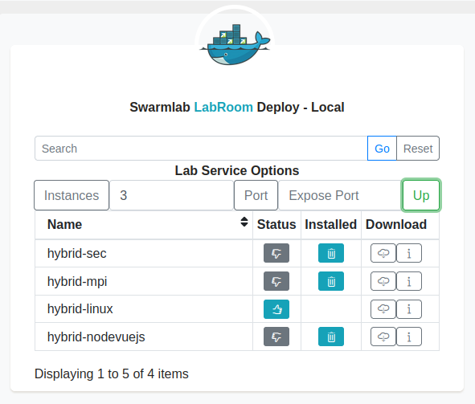
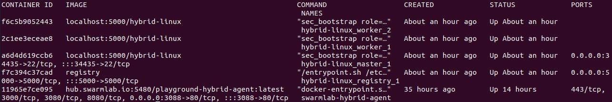
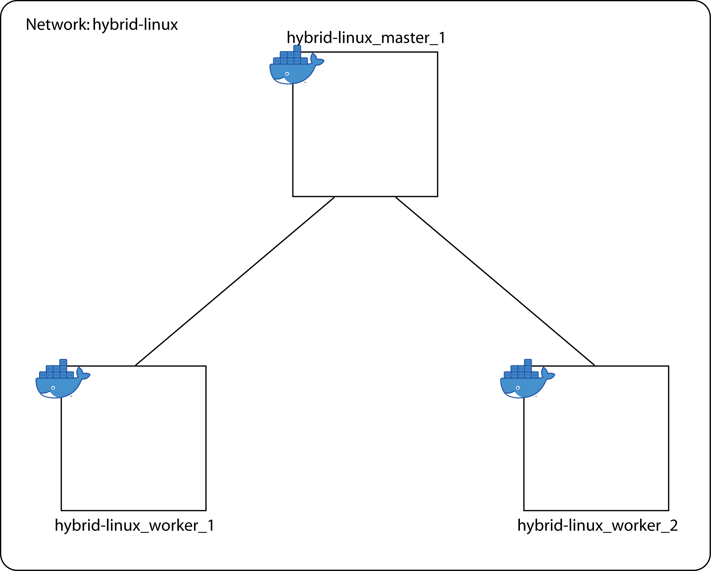
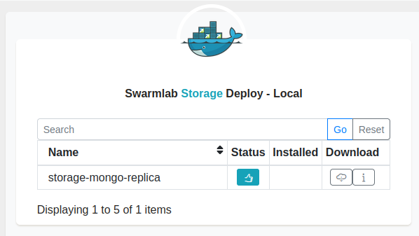
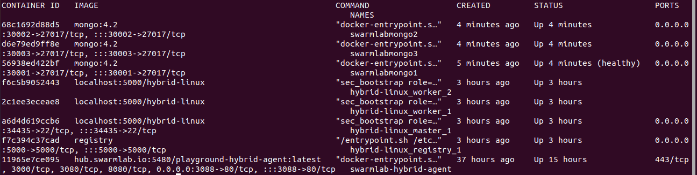
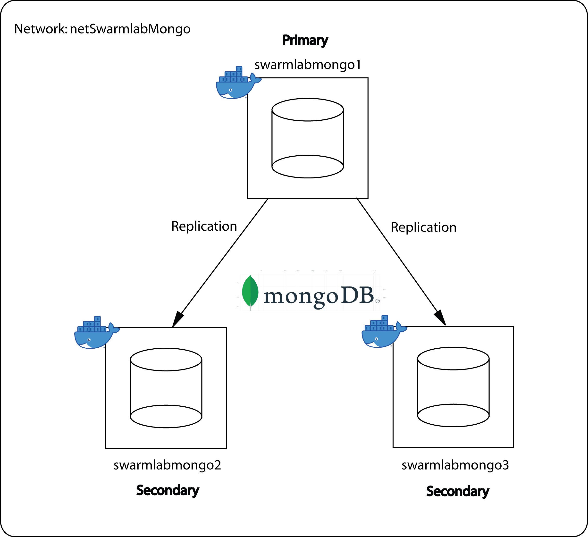
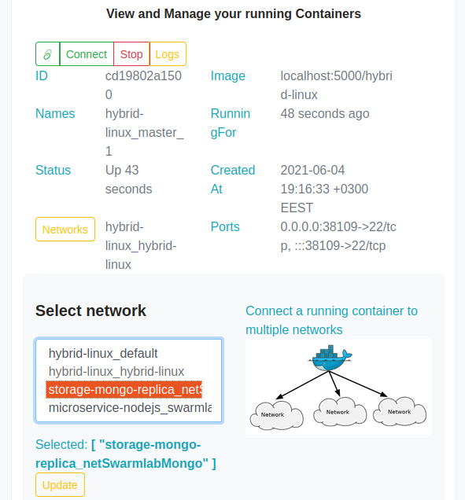

# Υπολογιστική Νέφους και Υπηρεσίες - Εργαστηριακή Άσκηση 2021: Υπηρεσία Συλλογής Δεδομένων (Data Collector Service)
[@simospsaraftis](https://github.com/simospsaraftis)

## Εγκατάσταση της Εφαρμογής

Στο παρόν αρχείο, περιγράφουμε τον τρόπο με τον οποίο μπορούμε να εγκαταστήσουμε την εφαρμογή, κάνοντας χρήση του εργαλείου [docker](https://www.docker.com/), το οποίο αποτελεί μία πλατφόρμα ανοικτού κώδικα, που προσφέρει αυτοματοποιημένες διαδικασίες, για την εύκολη υλοποίηση, διάθεση και εκτέλεση εφαρμογών.<br/>
Αρχικά, δείχνουμε πως μπορούμε μέσω του συγκεκριμένου εργαλείου, να δημιουργήσουμε ένα σμήνος (swarm), δηλαδή μία ομάδα από τερματικούς σταθμούς (hosts) που περιλαμβάνουν containers, τα οποία είναι πακέτα λογισμικού που περιέχουν όλα τα απαραίτητα προγράμματα και ρυθμίσεις, ούτως ώστε μία εφαρμογή να μπορεί να εκτελείται γρήγορα και αξιόπιστα σε διαφορετικά υπολογιστικά περιβάλλοντα.<br/>
Στη συνέχεια, εγκαθιστούμε τα απαραίτητα προγράμματα και ρυθμίσεις που πρέπει να περιέχει το καθε container, ούτως ώστε να εκτελούνται οι λειτουργίες της εφαρμογής.<br/><br/>

Για τη δημιουργία του σμήνους, αξιοποιείται η υπηρεσία [hybrid-linux](https://git.swarmlab.io:3000/swarmlab/hybrid-linux), που παρέχεται από το περιβάλλον [swarmlab.io](http://docs.swarmlab.io/), η εγκατάσταση και η διάθεση της οποίας πραγματοποιείται μέσω του εργαλείου [docker](https://www.docker.com/).

Για την υποστήριξη 'χώρου αποθήκευσης', αξιοποιείται η υπηρεσία [storage-mongo-replica](https://git.swarmlab.io:3000/swarmlab/storage-mongo-replica), που επίσης παρέχεται από το περιβάλλον [swarmlab.io](http://docs.swarmlab.io/).

Για την εγκατάσταση των υπηρεσιών στα containers, αξιοποιείται το repository [data_collector_service](https://github.com/simospsaraftis/data_collector_service.git).<br/><br/>

### 1. Προαπαιτούμενα<br/>

Για να αποκτήσουμε πρόσβαση στο περιβάλλον [swarmlab.io](http://docs.swarmlab.io/) και να μπορέσουμε να δημιουργήσουμε το σμήνος, στους κόμβους του οποίου θα εγκατασταθούν οι υπηρεσίες που θα παρέχει η εφαρμογή, πρέπει αρχικά να εγκαταστήσουμε την υπηρεσία swarmlab-hybrid και στη συνέχεια να δημιουργήσουμε λογαριασμό στο περιβάλλον [swarmlab.io](http://docs.swarmlab.io/).<br/>
Περισσότερες πληροφορίες για την εγκατάσταση της υπηρεσίας swarmlab-hybrid, μπορείτε να βρείτε [εδώ](https://git.swarmlab.io:3000/zeus/swarmlab-hybrid).<br/><br/>

### 2. Δημιουργία του σμήνους (swarm)<br/>

Σε αυτή τη παράγραφο, δείχνουμε πως μπορούμε να δημιουργήσουμε το σμήνος, το οποίο αποτελείται από έναν κεντρικό κόμβο, τον master, και έναν ή περισσότερους κόμβους με τους οποίους συνδέεται ο master, τους workers.
Για να το επιτύχουμε αυτό, αξιοποιούμε όπως είπαμε και παραπάνω, την υπηρεσία [hybrid-linux](https://git.swarmlab.io:3000/swarmlab/hybrid-linux) του [swarmlab.io](http://docs.swarmlab.io/).<br/>
Για τη δημιουργία του σμήνους, συνδεόμαστε με τον λογαριασμό μας στο [swarmlab.io](http://docs.swarmlab.io/), και αφού φορτώσουμε τις ρυθμίσεις μας και συνδεθούμε στον server του [swarmlab.io](http://docs.swarmlab.io/), μεταβαίνουμε στην καρτέλα Private/Local -> LabRoom και επιλέγουμε να σηκώσουμε τρια instances, δηλαδή τρεις τερματικούς σταθμούς στους οποίους θα είναι εγκατεστημένο το image [hybrid-linux](https://git.swarmlab.io:3000/swarmlab/hybrid-linux), εκ των οποίων ο ένας θα αποτελεί τον master και οι άλλοι δύο, τους workers του σμήνους:<br/><br/>

<br/><br/>

Να αναφέρουμε σε αυτό το σημείο, ότι για να μπορέσουν να εγκατασταθούν και να εκτελεστούν όλες οι υπηρεσίες που δύναται να παρέχονται στους χρήστες από την εφαρμογή, πρέπει να επιλέξουμε να δημιουργήσουμε τουλάχιστον δύο instances, δηλαδή το σμήνος να αποτελείται τουλάχιστον από έναν master και έναν worker.<br/>
Εκτελώντας την ακόλουθη εντολή, μπορούμε να δούμε τα containers που έχουν δημιουργηθεί στο [docker](https://www.docker.com/) και τα οποία αποτελούν τους κόμβους του σμήνους:<br/><br/>

```
docker container ls
```
<br/><br/>
<br/><br/>

Παρατηρώντας το αποτέλεσμα του τερματικού, μπορούμε να εντοπίσουμε τα τρία containers που έχουν δημιουργηθεί, καθώς και διάφορα χαρακτηριστικά τους.

Το σμήνος που δημιουργείται μέσω των παραπάνω ενεργειών, φαίνεται στο παρακάτω διάγραμμα:<br/><br/>

<br/><br/>

### 3. Κατανόηση της διαδικασίας δημιουργίας του σμήνους (swarm)<br/>

Για τον ορισμό των χαρακτηριστικών των κόμβων από τους οποίους αποτελείται το σμήνος, το [swarmlab.io](http://docs.swarmlab.io/) χρησιμοποιεί το ακόλουθο docker-compose.yml αρχείο:<br/><br/>


```
version: "2"

#Orizetai enas registry server
#o opoios tha akouei stin porta 5000
#kai xrisimopoieitai gia tin apothikeysi docker images
services:
  registry:
    image: registry
    ports:
      - "5000:5000"

#Orizetai o master
#o opoios tha xrisimopoiei to image hybrid-linux
#To onoma tou komvou master tha einai hybrid-linux_master_1
#kai to domain tou tha einai to hybrid-linux_hybrid-linux
#meso tou cap_add orizetai oti o master tha mporei na pragmatopoiei leitourgies diaxeiristi diktyou
#orizetai oti o xristis tou komvou master tha exei dikaiomata root
#ginetai mapping tis ssh portas stin porta tou host
#orizetai oti to diktyo sto opoio tha anikei o master tha einai to hybrid-linux 
  master:
    image: localhost:5000/hybrid-linux
    privileged: true
    environment:
     - NODENAME=hybrid-linux_master_1.hybrid-linux_hybrid-linux
     - NODENETWORK=hybrid-linux
    cap_add:
      - NET_ADMIN
    user: root
    entrypoint: ["sec_bootstrap", "role=master", "sec_master_service_name=master", "sec_worker_service_name=worker"]
    ports:
      - "${SSH_PORT}:22"
    networks:
      - hybrid-linux
    volumes:
      - /home/simos/swarmlab-hybrid/src-local/instance/hybrid-linux/hybrid-linux/project:/project


#Orizetai o worker
#o opoios tha xrisimopoiei to image hybrid-linux
#To domain tou komvou worker tha einai to hybrid-linux_hybrid-linux
#orizetai oti o worker tha mporei na pragmatopoiei leitourgies diaxeiristi diktyou
#orizetai oti o xristis tou komvou worker tha exei dikaiomata root
#orizetai oti to diktyo sto opoio tha anikei o worker tha einai to hybrid-linux
  worker:
    image: localhost:5000/hybrid-linux
    privileged: true
    environment:
     - NODENAME=hybrid-linux_master_1.hybrid-linux_hybrid-linux
     - NODENETWORK=hybrid-linux
    cap_add:
      - NET_ADMIN
    user: root
    entrypoint: ["sec_bootstrap", "role=worker", "sec_master_service_name=master", "sec_worker_service_name=worker"]
    networks:
      - hybrid-linux
    volumes:
      - /home/simos/swarmlab-hybrid/src-local/instance/hybrid-linux/hybrid-linux/project:/project

networks:
  hybrid-linux:
```
<br/><br/>
Για τη δημιουργία του σμήνους, το [swarmlab.io](http://docs.swarmlab.io/) χρησιμοποιεί το αρχείο με όνομα swarmlab-sec.<br/>
Πιο συγκεκριμένα, όταν πατάμε το πλήκτρο "Up" στο γραφικό περιβάλλον του [swarmlab.io](http://docs.swarmlab.io/), εκτελούνται οι ακόλουθες συναρτήσεις που περιλαμβάνονται στο αρχείο swarmlab-sec:<br/><br/>

```
# Otan patame to pliktro Up sto grafiko perivallon
# Ektelountai ta akoloutha
if [ $COMMAND_UP -eq 1 ]; then
    create_dockerfile
    down_all
    clear_all
    up_registry
    generate_ssh_keys
    build_and_push_image
    up_master
    up_workers

    prompt_ready
    show_instruction
```
<br/><br/>
Από τις παραπάνω συναρτήσεις, επικεντρωνόμαστε στη συνάρτηση up_master(), η οποία δημιουργεί τον master:
<br/><br/>
```
#Synartisi dimiourgias tou master
up_master ()
{
    printf "\\n\\n===> SPIN UP MASTER NODE"
    printf "\\n%s\\n" "$HEADER"
    echo "$ docker-compose up -d master"
    printf "\\n"
    docker-compose up -d master
}
```
<br/><br/>
και στη συνάρτηση up_workers() η οποία ορίζει το πλήθος των workers και τους δημιουργεί πραγματοποιώντας scaling της υπηρεσιας:
<br/><br/>

```
#Synartisi orismou tou plithous ton workers kai dimiourgias tous
#pragmatopoiontas scaling tis ypiresias
up_workers ()
{
    printf "\\n\\n===> SPIN UP WORKER NODES"
    printf "\\n%s\\n" "$HEADER"
    echo "$ docker-compose up -d worker"
    printf "\\n"
    docker-compose up -d worker

    printf "\\n"
    printf "\\n%s\\n" "$HEADER"

    NUM_WORKER=$((SIZE - 1))
    echo "$ docker-compose scale worker=$NUM_WORKER"
    printf "\\n"
    docker-compose scale worker=${NUM_WORKER}
}
```
<br/><br/>

### 4. Ορισμός υπηρεσίας για την υποστήριξη 'χώρου αποθήκευσης'<br/>

Σε αυτή τη παράγραφο, ορίζουμε την υπηρεσία για την υποστήριξη 'χώρου αποθήκευσης', η οποία είναι η [storage-mongo-replica](https://git.swarmlab.io:3000/swarmlab/storage-mongo-replica), που παρέχεται από το περιβάλλον [swarmlab.io](http://docs.swarmlab.io/).<br/>
Η συγκεκριμένη υπηρεσία δημιουργεί ένα replica set, δηλαδή ένα σύνολο που αποτελείται από τρια [MongoDB](https://www.mongodb.com/) instances, ένα primary και δύο secondary, εκ των οποίων το primary είναι αυτό που διαχειρίζεται όλες τις λειτουργίες ανάγνωσης και εγγραφής στη βάση. Τα τρία αυτά instances διατηρούν το ίδιο σύνολο αρχείων. Δημιουργώντας πολλαπλά αντίγραφα των δεδομένων σε διαφορετικά instances, το replica set προσφέρει το πλεονέκτημα ότι εάν το primary instance για κάποιο λόγο δεν είναι διαθέσιμο, κάποιο από τα secondary instances θα εκλεγεί να πάρει τη θέση του και έτσι δεν θα υπάρξει θέμα και όλα θα λειτουργήσουν ομαλά. Το replica set που περιγράψαμε παραπάνω, χρησιμοποιείται για την αποθήκευση των συμβάντων που συμβαίνουν στους τερματικούς σταθμούς του σμήνους.

Για να θέσουμε σε λειτουργία το replica set, στο [swarmlab.io](http://docs.swarmlab.io/) μεταβαίνουμε στην καρτέλα Private/Local -> Storage, εκτελούμε στο τερματικό την εντολή που μας εμφανίζει το σύστημα, και επιλέγουμε να σηκώσουμε τα τρια [MongoDB](https://www.mongodb.com/) instances:<br/><br/>


<br/><br/>


Εκτελώντας την ακόλουθη εντολή, μπορούμε να δούμε τα containers που έχουν δημιουργηθεί στο [docker](https://www.docker.com/):<br/><br/>

```
docker container ls
```

<br/><br/>
<br/><br/>


Παρατηρώντας το αποτέλεσμα του τερματικού, μπορούμε να δούμε εκτός των άλλων, και τα τρία [MongoDB](https://www.mongodb.com/) instances που δημιουργήσαμε.<br/><br/>

Το [MongoDB](https://www.mongodb.com/) replica set που δημιουργείται μέσω των παραπάνω ενεργειών, φαίνεται στο ακόλουθο διάγραμμα:<br/><br/>


<br/><br/>


### 5. Κατανόηση της διαδικασίας δημιουργίας της βάσης δεδομένων<br/>

Για τον ορισμό των [MongoDB](https://www.mongodb.com/) instances και των χαρακτηριστικών τους, το [swarmlab.io](http://docs.swarmlab.io/) χρησιμοποιεί το ακόλουθο docker-compose.yml αρχείο:<br/><br/>


```
version: '3.8'


services: 

    #Orizontai to replica_set
    #To replica_set tha xrisimopoiei to image mongo:4.2
    #Se periptosi apotixias tha yparxei i dynatotita restart
    #To replica_set tha anikei sto diktyo netSwarmlabMongo
    #Gia tin egatastasi tha xrisimopoihthei to bash arxeio mongosetup.sh
    #Orizontai oi default rythmiseis (username kai password) tou replica_set meso environment variables
    mongo-replica-setup:
        container_name: mongo-setup
        image: 'mongo:4.2'
        restart: on-failure
        networks:
            - netSwarmlabMongo
        volumes:
        - ./.docker/mongodb/scripts/mongosetup.sh:/scripts/mongosetup.sh
        # entrypoint: ["bash"]
        entrypoint: ["bash", "/scripts/mongosetup.sh" ]
        env_file:
            - .env
        environment:
            MONGO_INITDB_ROOT_USERNAME: ${MONGO_INITDB_ROOT_USERNAME}
            MONGO_INITDB_ROOT_PASSWORD: ${MONGO_INITDB_ROOT_PASSWORD}
        depends_on:
            - swarmlabmongo1
            - swarmlabmongo2
            - swarmlabmongo3

    #Orizontai to container swarmlabmongo1
    #Orizetai to hostname kai to container name na einai swarmlabmongo1
    #Orizetai oti tha xrisimopoiei to image mongo:4.2
    #Se periptosi apotixias tha yparxei i dynatotita restart
    #Orizetai oti to container tha akouei sti porta 27017
    #Orizetai i antistoixisi tis portas tou container sti porta tou docker host
    #To replica tha anikei sto diktyo newSwarmlabMongo
    #Tha elegxetai ean i vasi einai ok kathe 30 deyterolepta
    #Orizontai oi default rythmiseis (username kai password) tis vasis meso environment variables
    swarmlabmongo1:
        hostname: 'swarmlabmongo1'
        container_name: 'swarmlabmongo1'
        image: 'mongo:4.2'
        restart: 'on-failure'
        command: ["-f", "/etc/mongod.conf", "--keyFile", "/auth/file.key", "--replSet", "${MONGO_REPLICA_SET_NAME}", "--bind_ip_all"]
        expose: 
            - 27017
        ports: 
            - 30001:27017 
        networks: 
            - netSwarmlabMongo
        volumes:
            - swarmlabmongoData1:/data/db
            - swarmlabmongoLog1:/var/log/mongodb
            - ./.docker/mongodb/initdb.d/:/docker-entrypoint-initdb.d/
            - ./.docker/mongodb/mongod.conf:/etc/mongod.conf
            - ./.docker/mongodb/file.key:/auth/file.key
        healthcheck:
            test: test $$(echo "rs.status().ok" | mongo -u $${MONGO_INITDB_ROOT_USERNAME} -p $${MONGO_INITDB_ROOT_PASSWORD} --quiet) -eq 1
            interval: 30s
            start_period: 60s
        env_file:
            - .env
        environment:
            MONGO_INITDB_ROOT_USERNAME: ${MONGO_INITDB_ROOT_USERNAME}
            MONGO_INITDB_ROOT_PASSWORD: ${MONGO_INITDB_ROOT_PASSWORD}
            MONGO_INITDB_DATABASE: ${MONGO_INITDB_DATABASE}


    #Orizontai to container swarmlabmongo2
    #Orizetai to hostname kai to container name na einai swarmlabmongo2
    #Orizetai oti tha xrisimopoiei to image mongo:4.2
    #Se periptosi apotixias tha yparxei i dynatotita restart
    #Orizetai oti to container tha akouei sti porta 27017
    #Orizetai i antistoixisi tis portas tou container sti porta tou docker host
    #To replica tha anikei sto diktyo newSwarmlabMongo
    #Tha elegxetai ean i vasi einai ok kathe 30 deyterolepta
    #Orizontai oi default rythmiseis (username, password kai onoma) tis vasis meso environment variables
    #To depends_on: - swarmlabmongo1 deixnei poia replica einai to primary
    swarmlabmongo2:
        hostname: 'swarmlabmongo2'
        container_name: 'swarmlabmongo2'
        image: 'mongo:4.2'
        command: ["-f", "/etc/mongod.conf", "--keyFile", "/auth/file.key", "--replSet", "${MONGO_REPLICA_SET_NAME}", "--bind_ip_all"]
        restart: 'on-failure'
        expose: 
            - 27017
        ports: 
            - 30002:27017  
        networks: 
            - netSwarmlabMongo
        volumes:
            - swarmlabmongoData2:/data/db
            - swarmlabmongoLog2:/var/log/mongodb
            - ./.docker/mongodb/mongod.conf:/etc/mongod.conf
            - ./.docker/mongodb/file.key:/auth/file.key
        env_file:
            - .env
        environment:
            MONGO_INITDB_ROOT_USERNAME: ${MONGO_INITDB_ROOT_USERNAME}
            MONGO_INITDB_ROOT_PASSWORD: ${MONGO_INITDB_ROOT_PASSWORD}
            MONGO_INITDB_DATABASE: ${MONGO_INITDB_DATABASE}
        depends_on: 
            - swarmlabmongo1


    #Orizontai to container swarmlabmongo3
    #Orizetai to hostname kai to container name na einai swarmlabmongo3
    #Orizetai oti tha xrisimopoiei to image mongo:4.2
    #Se periptosi apotixias tha yparxei i dynatotita restart
    #Orizetai oti to container tha akouei sti porta 27017
    #Orizetai i antistoixisi tis portas tou container sti porta tou docker host
    #To replica tha anikei sto diktyo newSwarmlabMongo
    #Tha elegxetai ean i vasi einai ok kathe 30 deyterolepta
    #Orizontai oi default rythmiseis (username, password kai onoma) tis vasis meso environment variables
    #To depends_on: - swarmlabmongo1 deixnei poia replica einai to primary
    swarmlabmongo3:
        hostname: 'swarmlabmongo3'
        container_name: 'swarmlabmongo3'
        image: 'mongo:4.2'
        command: ["-f", "/etc/mongod.conf", "--keyFile", "/auth/file.key", "--replSet", "${MONGO_REPLICA_SET_NAME}", "--bind_ip_all"]
        restart: 'on-failure'
        expose: 
            - 27017
        ports: 
            - 30003:27017  
        networks: 
            - netSwarmlabMongo
        volumes:
            - swarmlabmongoData3:/data/db
            - swarmlabmongoLog3:/var/log/mongodb
            - ./.docker/mongodb/mongod.conf:/etc/mongod.conf
            - ./.docker/mongodb/file.key:/auth/file.key
        env_file:
            - .env
        environment:
            MONGO_INITDB_ROOT_USERNAME: ${MONGO_INITDB_ROOT_USERNAME}
            MONGO_INITDB_ROOT_PASSWORD: ${MONGO_INITDB_ROOT_PASSWORD}
            MONGO_INITDB_DATABASE: ${MONGO_INITDB_DATABASE}
        depends_on: 
            - swarmlabmongo1

volumes: 
    swarmlabmongoData1:
    swarmlabmongoData2:
    swarmlabmongoData3:
    swarmlabmongoLog1:
    swarmlabmongoLog2:
    swarmlabmongoLog3:

networks: 
    netSwarmlabMongo:
```
<br/><br/>

Για τη δημιουργία και το deploy των containers, το [swarmlab.io](http://docs.swarmlab.io/) χρησιμοποιεί το ακόλουθο bash αρχείο με όνομα run.sh:<br/><br/>

```
#!/bin/sh

#To sygekrimeno bash arxeio dimiourgei kai kanei deploy ta containers
#swarmlabmongo1, swarmlabmongo2 kai swarmlabmongo3
docker-compose down
docker-compose rm
docker container rm swarmlabmongo1 swarmlabmongo2 swarmlabmongo3
docker-compose up -d
```
<br/><br/>
Οι default ρυθμίσεις των τριών [MongoDB](https://www.mongodb.com/) instances, βρίσκονται στο ακόλουθο bash αρχείο με όνομα connect.mongo.sh:
<br/><br/>

```
#Default rythmiseis ton trion MongoDB instances
MONGO_INITDB_ROOT_USERNAME=swarmlab
MONGO_INITDB_ROOT_PASSWORD=swarmlab
MONGO_INITDB_DATABASE=app_swarmlab
MONGO_INITDB_USERNAME=app_swarmlab
MONGO_INITDB_PASSWORD=app_swarmlab
MONGO_REPLICA_SET_NAME=rs0

mongo "mongodb://localhost:30001,localhost:30002,localhost:30003/$MONGO_INITDB_DATABASE" -u $MONGO_INITDB_USERNAME
mongo "mongodb://localhost:30001,localhost:30002,localhost:30003/app_swarmlab" -u app_swarmlab

```
<br/><br/>

### 6. Σύνδεση των κόμβων του σμήνους με το δίκτυο στο οποίο βρίσκεται η βάση δεδομένων<br/>

Για λόγους καλύτερης διαχείρισης, ορίζουμε η υπηρεσία της βάσης δεδομένων, να βρίσκεται σε διαφορετικό δίκτυο από τους κόμβους του σμήνους.<br/>
Επομένως, για να μπορούν να μεταφέρονται και να αποθηκεύονται στη βάση δεδομένων τα συμβάντα που συμβαίνουν στους κόμβους του σμήνους, και συλλέγονται μέσω του [fluentd](https://www.fluentd.org/), πρέπει οι κόμβοι του σμήνους να είναι συνδεδεμένοι και με το δίκτυο της βάσης δεδομένων.

Για να πραγματοποιήσουμε αυτή τη σύνδεση, χρησιμοποιούμε το interface του [swarmlab.io](http://docs.swarmlab.io/).<br/>
Αρχικά, μεταβαίνουμε στην καρτέλα Instances -> Container και επιλέγουμε το container hybrid_linux_master_1, το οποίο αντιστοιχεί στον master του σμήνους. Στη συνέχεια, πατάμε το κουμπί "Networks" το οποίο μας εμφανίζει τα διαθέσιμα δίκτυα, επιλέγουμε το δίκτυο storage-mongo-replica_netSwarmlabMongo, το οποίο αποτελεί το δίκτυο στο οποίο βρίσκεται η βάση δεδομένων, και πατάμε το κουμπί "Update", όπως φαίνεται στην παρακάτω εικόνα:<br/><br/>


<br/><br/>


Πραγματοποιούμε την ίδια διαδικασία και για τους δύο workers (hybrid-linux_worker_1 και hybrid-linux_worker_2), ούτως ώστε να συνδέονται και αυτοί με το δίκτυο της βάσης δεδομένων.<br/>
Πλέον, μπορούν να μεταφέρονται και να αποθηκεύονται στη βάση δεδομένων τα συμβάντα που συμβαίνουν στους κόμβους του σμήνους, και συλλέγονται μέσω του [fluentd](https://www.fluentd.org/).<br/><br/>


### 7. Εγκατάσταση της υπηρεσίας για τη συλλογή συμβάντων που συμβαίνουν στους κόμβους του σμήνους<br/>


Εισερχόμαστε στον κόμβο hybrid-linux_master_1, δηλαδή στον κόμβο που αποτελεί τον master, εκτελώντας την ακόλουθη εντολή στο τερματικό:<br/><br/>
```
docker exec -it -udocker hybrid-linux_master_1 /bin/bash
```
<br/><br/>
Έπειτα, κατεβάζουμε το repository [data_collector_service](https://github.com/simospsaraftis/data_collector_service.git) και εισερχόμαστε σε αυτό, μέσω των ακόλουθων εντολών:
<br/><br/>
```
sudo git clone https://github.com/simospsaraftis/data_collector_service.git

cd data_collector_service
```
<br/><br/>
Στη συνέχεια εκτελούμε την ακόλουθη εντολή, ούτως ώστε να δούμε τα υπόλοιπα μέλη του σμήνους:
<br/><br/>
```
./bin/swarmlab-nmap
```
<br/><br/>
και λαμβάνουμε ως αποτέλεσμα τις IP διευθύνσεις των δύο worker.

Το αρχείο μέσω του οποίου πραγματοποιείται αυτή η λειτουργία είναι το ακόλουθο bash αρχείο με όνομα swarmlab-nmap που βρίσκεται στον κατάλογο data_collector_service/bin:
<br/><br/>
```
#/bin/sh

#H akolouthi entoli emfanizei ta ypoloipa meli tou sminous

#ip=`nslookup hybrid-mpi_master_1.hybrid-mpi_hybrid-mpi | grep Addr | cut -d':' -f2 | grep -v 127.0.`
ip=`nslookup $NODENAME | grep Addr | cut -d':' -f2 | grep -v 127.0.`
nmap -sn -oG - $ip/24 | grep Up | grep $NODENETWORK | cut -d ' ' -f 2

```
<br/><br/>
Πραγματοποιούμε εγκατάσταση της υπηρεσίας [fluentd](https://www.fluentd.org/) στους κόμβους του σμήνους, ούτως ώστε να συλλέγονται τα συμβάντα που συμβαίνουν σε αυτούς και να αποθηκεύονται στη βάση δεδομένων.<br/>
Μεταφερόμαστε στον κατάλογο /data_collector_service/fluentd που περιέχει τα αρχεία για την εγκατάσταση της υπηρεσίας [fluentd](https://www.fluentd.org/).<br/>
Στον κατάλογο conf βρίσκεται το αρχείο fluent.conf το οποίο περιέχει ρυθμίσεις σχετικά με το πως θέλουμε να λειτουργήσει το [fluentd](https://www.fluentd.org/):
<br/><br/>
```
#
config
<match debug.*>
  @type stdout
</match>

#===========================================================================#
# block kodika pou dilonei: 
# 1) apo pou tha diavazei to fluentd logs diaforon programaton, meso tou path
# 2) ti tha diavazei to fluentd, meso tou @type
# 3) pos tha onomazei to fluentd ayta pou tha diavazei, meso tou tag
# ayta pou diavazei to fluentd metatrepontai se json
# to pos_file einai to arxeio pou tha dimiourgithei mesa ston katalogo
# gia na gnorizei to fluentd pou itan tin proigoumeni fora
#============================================================================#
<source>
  @type tail

  path /var/log/*.log
  path_key tailed_path

  tag stats.node

  # parse json
  <parse>
    @type json
  </parse>

  pos_file /tmp/fluentd--1605454018.pos
</source>
#=========================================================================#

#=========================================================================#
# block kodika pou dilonei:
# 1) apo pou tha diavazei to fluentd plirofories pou o xristis apothikeyei 
# kai oi opoies thelei na metaferthoun, meso tou path
# 2) ti tha diavazei to fluentd, meso tou @type
# 3) pos tha onomazei to fluentd ayta pou tha diavazei, meso tou tag
# den metatrepei ayta pou to fluentd diavazei se allo typo arxeiou
# to pos_file einai to arxeio pou tha dimiourgithei mesa ston katalogo
# gia na gnorizei to fluentd pou itan tin proigoumeni fora
#==========================================================================#
<source>
  @type tail

  path /var/log-in/*/*
  path_key tailed_path

  tag log.node

  # parse none
  <parse>
    @type none
  </parse>

  pos_file /tmp/fluentd--1605454014.pos
</source>


#====================================================================================#
# Otan tha symvei kati me tag "log", to fluentd tha to apothikeysei sti vasi dedomenon
# Orizetai to onoma tis vasis, to onoma xristi, to password, to replica_set
# I vasi einai mia vasi dedomenon pou exo ftiaxei eidika gia ayton ton skopo
# Exoyme episis, oti kathe 20 deyterolepta, to fluentd tha sozei ta dedomena sti vasi
#=====================================================================================#
<match log.*>
  @type copy
  <store>
          @type mongo_replset

          database app_swarmlab
          collection logs
          nodes swarmlabmongo1:27017,swarmlabmongo2:27017,swarmlabmongo3:27017

          user app_swarmlab
          password app_swarmlab

          replica_set rs0
          num_retries 60
          capped
          capped_size 100m


          <buffer>
            flush_interval 20s
          </buffer>
  </store>
  <store>
        @type stdout
  </store>

#  <store>
#         @type file
#         path /tmp/mylog
#         <buffer>
#           timekey 1d
#           timekey_use_utc true
#           timekey_wait 10s
#         </buffer>
#  </store>


</match>

#==================================================================================================#
# Antistoixa, otan tha symvei kati me tag "stats", to fluentd tha to apothikeysei sti vasi dedomenon
# Orizetai to onoma tis vasis, to onoma xristi, to password, to replica_set
# I vasi einai mia vasi dedomenon pou exo ftiaxei eidika gia ayton ton skopo
# Exoyme episis, oti kathe 20 deyterolepta, to fluentd tha sozei ta dedomena sti vasi
#==================================================================================================#
<match stats.*>
  @type copy
  <store>
          @type mongo_replset

          database app_swarmlab
          collection logs
          nodes swarmlabmongo1:27017,swarmlabmongo2:27017,swarmlabmongo3:27017

          user swarmlab
          password swarmlab

          replica_set rs0
          num_retries 60
          capped
          capped_size 100m
  </store>
  <store>
       @type stdout
  </store>
</match>

```
<br/><br/>
Επίσης, στον κατάλογο /data_collector_service/fluentd διαθέτουμε ένα αρχείο γραμμένο σε yaml με όνομα fluentd.yml, το οποίο περιλαμβάνει όλες εκείνες τι εντολές και εγκαταστάσεις που θέλουμε να πραγματοποιήσουμε απομακρυσμένα στους κόμβους του συστήματος μέσω του [ansible](https://www.ansible.com/):
<br/><br/>
```
---
- hosts: service
  remote_user: docker
  gather_facts: no
  vars:
    user: "docker"
  tasks:

     # ----------------------------------------------------
     # task gia tin enimerosi ton idi egatestimenon paketon
     # ----------------------------------------------------
    - name: apt update packages
      become: true
      apt:
        update_cache: 'yes'
        force_apt_get: 'yes'
        upgrade: 'dist'
        cache_valid_time: 3600
        install_recommends: true
        autoremove: true

     # ----------------------------------------------
     # task gia tin egatastasi ton akolouthon paketon
     # ----------------------------------------------
    - name: apt install packages
      become: true
      apt:
        update_cache: 'yes'
        force_apt_get: 'yes'
        install_recommends: true
        autoremove: true
        name: "{{ packages }}"
      vars:
        packages:
         - build-essential
         - git
         - flex
         - bison
         - traceroute
         - curl
         - lynx
         - ruby
         - ruby-dev

     # --------------------------------------------------------------------------------
     # task gia ti dimiourgia directory gia to fluentd apomakrismena me dikaiomata root
     # pou na anikei ston xristi kai sto group docker kai na exei pliri dikaiomata
     # --------------------------------------------------------------------------------
    - name: make /var/log-in
      become: true
      file:
        path: "/var/log-in"
        state: directory
        owner: docker
        group: docker
        mode: '0777'

     # -----------------------------------------------------------------------------------------
     # gem begin
     # tasks gia tin egatastasi paketon pou einai anagaia gia ti leitourgia tou fluentd meso gem
     # -----------------------------------------------------------------------------------------
    - name: make dir for gem
      become: true
      file:
        path: "/home/docker/.gem"
        state: directory
        owner: docker
        group: docker
        mode: '0755'

    - name: gem install  fluentd
      #become: true
      gem:
        name: fluentd
        version: 1.12.0
        state: present
      environment:
        CONFIGURE_OPTS: '--disable-install-doc'
        PATH: '/home/docker/.gem/ruby/2.5.0/bin:{{ ansible_env.PATH }}'

    - name: gem install fluent-plugin-mongo
      #become: true
      gem:
        name: fluent-plugin-mongo
        state: present

    - name: gem install oj
      #become: true
      gem:
        name: oj
        state: present

    - name: gem install json
      #become: true
      gem:
        name: json
        state: present

    - name: gem install async-http
      #become: true
      gem:
        name: async-http
        version: 0.54.0
        state: present

    - name: gem install ext-monitor
      #become: true
      gem:
        name: ext_monitor
        version: 0.1.2
        state: present

     # ------------------------
     # gem end
     # -------------------------

     # --------------------------------------------------------------------------------------------------
     # task gia ti dimiourgia directory gia to config arxeio tou fluentd apomakrismena me dikaiomata root
     # pou na anikei ston xristi kai sto group docker kai na exei sygekrimena dikaiomata
     # --------------------------------------------------------------------------------------------------
    - name: make dir fluentd
      become: true
      file:
        path: "/fluentd/etc"
        state: directory
        owner: docker
        group: docker
        mode: '0755'

    - name: make dir fluentd
      become: true
      file:
        path: "/fluentd/plugins"
        state: directory
        owner: docker
        group: docker
        mode: '0755'

     # ----------------------------------------------------------------------------------------------------------
     # task pou antigrafei to fluentd.conf arxeio pou exoume dimiourgisei kai periexei to configuration tou 
     # fluentd, sto directory pou dimiourgisame parapano me xristi kai group to docker kai sygekrimena dikaiomata
     # ----------------------------------------------------------------------------------------------------------
    - name: cp fluentd.conf
      become: true
      copy:
        src: "./conf/fluent.conf"
        dest: /fluentd/etc/fluent.conf
        owner: docker
        group: docker
        mode: 0755

     # --------------------------------
     # task gia tin ekinisi tou fluentd
     # --------------------------------
    - name: start fluentd background
      shell: nohup /home/docker/.gem/ruby/2.5.0/bin/fluentd -c /fluentd/etc/fluent.conf -vv </dev/null >/dev/null 2>&1 &

```
<br/><br/>
Για να εγκαταστήσουμε και να τρέξουμε το [ansible](https://www.ansible.com/), το οποίο εγκαθιστά την υπηρεσία [fluentd](https://www.fluentd.org/) σε όλους τους κόμβους του σμήνους, έχουμε δημιουργήσει το ακόλουθο bash αρχείο με όνομα fluentd.yml.sh: 
<br/><br/>
```
!/bin/sh

# Entoli pou enimeronei ta idi egatestimena paketa
sudo apt update -y

# Entoli pou pragmatopoiei egatastasi tou ansible
sudo apt install -y ansible sshpass

# Entoli pou orizei ton xristi tou directory fluentd
sudo chown $(whoami) /data_collector_service/fluentd/

# Entoli pou dinei dikaiomata read,write kai execute sto directory fluentd
sudo chmod +rwx /data_collector_service/fluentd/


# Entoli pou dimiourgei enan kryfo katalogo gia to ansible sto docker
sudo mkdir -p /home/docker/.ansible

#Entoli pou orizei oti o xristis tou directory docker tha einai o docker
sudo chown docker.docker -R /home/docker


# Entoli pou metaferei to arxeio me to default configuration tou ansible
# ston katalogo /etc/ansible, opou exei egatastathei to ansible
sudo cp ../ansible/ansible.cfg /etc/ansible/ansible.cfg


# Me tis parakato entoles vriskoume tin topiki IPv4 kai IPv6 dieythynsi
ip4=$(/sbin/ip -o -4 addr list eth0 | awk '{print $4}' | cut -d/ -f1)
ip6=$(/sbin/ip -o -6 addr list eth0 | awk '{print $4}' | cut -d/ -f1)


# Entoli pou dimiourgei kai prosthetei sto arxeio inventory.yml ta mixanakia sta opoia epithymoume na egatastahei to fluentd
echo "[service]" > /data_collector_service/fluentd/inventory.yml
/project/bin/swarmlab-nmap >> /data_collector_service/fluentd/inventory.yml


# Entoli pou prosthetei kai ton master sto inventory.yml,
# dioti theloume na egatastathei kai se ayton to fluentd
echo $ip4 >> /data_collector_service/fluentd/inventory.yml


# Entoli pou trexei to ansible-playbook,
# outos oste na pragmatopoiithoun oi egatastaseis sta mixanakia pou anaferontai sto inventory.yml
# Orizoume to ansible na anoigei 5 syndeseis taytoxrona
ansible-playbook -u docker -i inventory.yml fluentd.yml  -f 5  --ask-pass --ask-become-pass


```
<br/><br/>
Έχοντας μελετήσει τα αρχεία, εκτελούμε το αρχείο fluentd.yml.sh μέσω της ακόλουθης εντολής, όπου στα σημεία που ζητείται password, πληκτρολογούμε το password του συστήματος:
<br/><br/>
```
./fluentd.yml.sh
```
<br/><br/>
Εάν δεν υπάρχουν κόκκινα μηνύματα σφάλματος, η υπηρεσία [fluentd](https://www.fluentd.org/) έχει εγκατασταθεί επιτυχώς.


### 8. Εγκατάσταση της υπηρεσίας για τη μεταφορά των δεδομένων από τη βάση δεδομένων στους κόμβους του σμήνους<br/>

Για τη μεταφορά των δεδομένων από τη βάση δεδομένων στους κόμβους του σμήνους, στήνουμε μία υπηρεσία client-server, κάνοντας χρήση του [node.js](https://nodejs.org/en/) και του [Socket.IO](https://socket.io/). Πιο συγκεκριμένα, σηκώνουμε στον master έναν server, στον οποίο συνδέονται οι workers ως clients μέσω του [Socket.IO](https://socket.io/). Ο server ακούει για τυχόν προσθήκες δεδομένων/συμβάντων στη βάση δεδομένων μέσω ενός ChangeStream και στέλνει τα δεδομένα αυτά στους clients, οι οποίοι στη συνέχεια τα εμφανίζουν στο τερματικό.<br/>
Τα αρχεία για την εγκατάσταση της υπηρεσίας, βρίσκονται μέσα στον κατάλογο /data_collector_service/app.

Το [node.js](https://nodejs.org/en/) αρχείο που περιέχει τον κώδικα για τον server έχει όνομα app.js και είναι το ακόλουθο:
<br/><br/>
```
var express = require('express');		//Module gia to web application framework
var app = express();		//Dimiourgia enos express application


const helmet = require('helmet');		//To module helmet parexei asfaleia 
app.use(helmet());                  //sto express app thetontas HTTP headers


app.use(express.json());		//Orizoume oti tha xeirizetai ta requests os JSON


var http = require('http');		//Module pou epitrepei metafora dedomenon pano apo to HTTP protocol
var serverPort = "8085";		//Orizoume tin porta stin opoia tha akouei o server
var server = http.createServer(app);		//Dimiourgia tou server


require('dotenv').config();		//Module gia ti fortosi ton environment variables


var MongoClient = require('mongodb').MongoClient;		//Dimiourgei ena MongoClient instance gia ti syndesi me ti MongoDB


//Module pou parexei enan mixanismo meso tou opoiou o server orizei apo poio allo
//origin pera apo to diko tou tha epitrepei prosvasi stous porous tou
const cors = require('cors');

//Anaferoume oti tha epitrepetai i prosvasi se olo to diktyo meso tou port 8085
//kai tha apagoreyetai i prosvasi se osous aitountai prosvasi
//alla vriskontai ektos tou diktiou
var allowedOrigins = [ 
	"http://0.0.0.0:8085"
];


//Module pou parexei to Socket.IO gia tin amfidromi epikoinonia metaxi client kai server
//Anaferoume oti tha epitrepetai i prosvasi apo ta origins pou orizoume sti metavliti allowedOrigins
//gia GET kai POST
const io = require("socket.io")(server, {
	cors: {
		origin: allowedOrigins,
		methods: ["GET", "POST"]
	}
});


//O server akouei gia tyxon syndeseis client se ayton, sto port pou vrisketai sti metavliti serverPort
server.listen(serverPort, () => {
	console.log("HTTP server listening on port %s", serverPort);
});


//Otan kapoios client sindethei me ton server, emfanizetai katallilo minima
//Antistoixo minima emfanizetai kai otan o client aposyndethei
io.on('connection', (socket) => {
	console.log("Client connected");

	socket.on('disconnect',() => {
		console.log("Client disconnected");
	});
});


//Block kodika meso tou opoiou o server pragmatopoiei syndesi me ti vasi kai anoigei ena ChangeStream gia na akouei gia 
//tyxon allages pou symvainoun sti vasi kai na tis stelnei stous ypoloipous komvous tou sminous
//Ta stoixeia syndesis sti vasi einai apothikeymena mesa se environment variables
//Se periptosi pou gia kapoio logo den einai epityxis i sndesi me ti vasi otan pragmatopoieitai syndesi gia proti fora,
//o server epixeirei na syndethei xana me ti vasi kathe 5 deyterolepta

var mongourl = "mongodb://"+process.env.MONGO_INITDB_ROOT_USERNAME+":"+process.env.MONGO_INITDB_ROOT_PASSWORD+"@"+process.env.MONGO_INITDB_NAME+":"+process.env.MONGO_INITDB_PORT+"/";

var connectWithRetry = function() {

	return MongoClient.connect(mongourl,{useNewUrlParser: true, useUnifiedTopology: true},(err, client) => {
		if(err)
		{
			console.error("\n Failed to connect to mongodb on startup - retrying in 5 seconds \n\n", err);
			setTimeout(connectWithRetry, 5000);
		}
		else
		{
			var db = client.db(process.env.MONGO_INITDB_DATABASE);
			console.log("Connected to mongodb");

			const taskCollection = db.collection(process.env.MONGO_INITDB_COLLECTION);
			const changeStream = taskCollection.watch();


			//To ChangeStream akouei gia tyxon allages pou symvainoun sti vasi
			//Otan pragmatopoieithei kapoio insert sti syllogi "logs" tis vasis,
			//tha stalei ena insert event ston server meso tou ChangeStream 
			//kai o server afou emfanisei to periexomeno tou event sto termatiko tou, tha ta steilei stous clients meso tou io.emit()
			changeStream.on('change', (change) => {
				if (change.operationType === 'insert') 
				{
					const content = {
						id: change.fullDocument._id,
						message: change.fullDocument.message,
						tailed_path: change.fullDocument.tailed_path,
						time: change.fullDocument.time
					}

					console.log(content);
					io.emit('change_msg',content);
				}
				//Ean stalei kapoio invalidate event tote to ChangeStream tha kleisei
				//Opote exoume orisei se ayti ti periptosi na emfanizetai sto termatiko to minima "ChangeStream closed"
				//Ena invalidate event stelnetai otan ginei drop i metonomasia tis syllogis i opoia parakoloutheitai 
				//meso to ChangeStream, i otan ginei drop olokliris tis vasis
				else if (change.operationType === 'invalidate')
				{
					console.log("ChangeStream closed");
				}
			});
			//Ean yparxei kapoio error, ayto emfanizetai sto termatiko
			changeStream.on('error', (err) => {
				console.log(err);
			});
		}
	});
};
connectWithRetry();
```
<br/><br/>
Το [node.js](https://nodejs.org/en/) αρχείο που περιέχει τον κώδικα για τον client έχει όνομα client.js και είναι το ακόλουθο:
<br/><br/>
```
const io = require("socket.io-client");		//Socket.IO module gia ton client


//Orizoume to URL gia ti syndesi me ton master
//Exoume dosei onomata ston master kai stous workers outos oste na mporoume na anaferomaste se aytous
//xoris na xrisimopoioume tis IP dieythinseis tous
const URL = "http://hybrid-linux_master_1:8085";


const socket = io.connect(URL, {reconnect:true});		//Anoigei mia syndesi me ton master (server), sto port 8085


socket.on('connect', (socket) => {		//Otan o client syndethei me ton server, emfanizetai katallilo minima
	console.log("Client connected");
});


//O client akouei gia tyxon minimata apo ton server kai otan o server steilei minima 
//ston client sxetika me kapoia alagi pou exei ginei sti vasi dedomenon, 
//o client to lamvanei kai to emfanizei sto terminal
socket.on('change_msg', (msg) => {
	console.log(msg);
});

```


Μεταβαίνουμε στον κατάλογο /data_collector_service/app.<br/>
Ο κώδικας για την εγκατάσταση του [node.js](https://nodejs.org/en/) και των πακέτων που χρειάζονται, βρίσκεται στο ακόλουθο bash αρχείο με όνομα app.js.sh:


```
# Egatastasi tou nodejs kai ton aparaititon paketon, outos oste na leitourgisei i ypiresia client-server
curl -sL https://deb.nodesource.com/setup_16.x -o nodesource_setup.sh \
&& sudo bash nodesource_setup.sh \
&& sudo apt-get install -y nodejs \
&& npm install \
&& npm install socket.io \
&& npm install socket.io-client \
&& npm install mongodb \
&& npm install express \
&& npm install helmet \
&& npm install dotenv

```
<br/><br/>
Εκτελούμε το bash αρχείο για την εγκατάσταση του [node.js](https://nodejs.org/en/) και των πακέτων, μέσω της ακόλουθης εντολής:
<br/><br/>
```
sudo ./app.js.sh
```
<br/><br/>
Τα πακέτα που εγκαθιστούμε, καθώς και οι εξαρτήσεις τους βρίσκονται στο ακόλουθο json αρχείο με όνομα package.json:
<br/><br/>
```
    {
      "dependencies": {
        "dotenv": "^10.0.0",
        "express": "^4.17.1",
        "helmet": "^4.6.0",
        "mongodb": "^3.6.9",
        "socket.io": "^4.1.2",
        "socket.io-client": "^4.1.2"
      }
    }
```
<br/><br/>
Σε αυτό το σημείο, έχουμε εγκαταστήσει το [node.js](https://nodejs.org/en/) και τα απαραίτητα πακέτα για την εκτέλεση του server στον master. Πρέπει να εγκαταστήσουμε το [node.js](https://nodejs.org/en/) και στους workers, ούτως ώστε να μπορούν να συνδέονται στον server ως clients. Για να το επιτύχουμε αυτό, χρησιμοποιούμε το [ansible](https://www.ansible.com/).<br/>
Πιο συγκεκριμένα, χρησιμοποιούμε ένα αρχείο γραμμένο σε yaml με όνομα nodejs.yml, το οποίο περιλαμβάνει όλες εκείνες τι εντολές και εγκαταστάσεις που θέλουμε να πραγματοποιήσουμε απομακρυσμένα στους κόμβους του συστήματος μέσω του [ansible](https://www.ansible.com/):
<br/><br/>
```
---
- hosts: service
  remote_user: docker
  gather_facts: no
  vars:
    user: "docker"
  tasks:

     # ----------------------------------------------------------------------
     # task pou diagrafei to directory client_file ean yparxei idi stous workers
     # ----------------------------------------------------------------------
    - name: client directory remove
      become: true
      file:
        state: absent
        path: /client_file

     # ----------------------------------------------------------
     # task pou dimiourgei to directory client_file stous workers
     # ----------------------------------------------------------
    - name: make /client_file
      become: true
      file:
        path: "/client_file/"
        state: directory
        owner: docker
        group: docker
        mode: '0777'

     # ---------------------------------------------------------------------------------------------
     # task pou antigrafei to arxeio client.js pou periexei ton kodika gia ton client, stous workers
     # ---------------------------------------------------------------------------------------------
    - name: cp client.js
      become: true
      copy:
        src: "./../app/client.js"
        dest: /client_file/client.js
        owner: docker
        group: docker
        mode: '0755'

     # --------------------------------------------------------------
     # task pou katevazei to nodesource_setup.sh arxeio stous workers
     # --------------------------------------------------------------
    - name: nodesource get
      get_url:
        url: https://deb.nodesource.com/setup_16.x
        dest: /client_file/nodesource_setup.sh

     # ------------------------------------------------------------
     # task pou ektelei to nodesource_setup.sh arxeio stous workers
     # ------------------------------------------------------------
    - name: start nodesource run
      become: true
      command: bash /client_file/nodesource_setup.sh

     # --------------------------------------------------------------------
     # task pou diagrafei to nodesource_setup.sh arxeio meta tin egatastasi
     # --------------------------------------------------------------------
    - name: start nodesource remove
      become: true
      file: 
        state: absent
        path: /client_file/nodesource_setup.sh

     # ------------------------------------------------------------------
     # task gia tin enimerosi ton idi egatestimenon paketon stous workers
     # ------------------------------------------------------------------
    - name: apt update packages
      become: true
      apt:
        update_cache: 'yes'
        force_apt_get: 'yes'
        upgrade: 'dist'
        cache_valid_time: 3600
        install_recommends: true
        autoremove: true

     # ------------------------------------------------
     # task gia tin egatastasi tou nodejs stous workers
     # ------------------------------------------------
    - name: apt install packages
      become: true
      apt:
        update_cache: 'yes'
        force_apt_get: 'yes'
        install_recommends: true
        autoremove: true
        name: "{{ packages }}"
      vars:
        packages:
         - nodejs

     # ------------------------------------------------------------------------------------------
     # npm begin
     # tasks gia tin egatastasi paketon pou einai anagaia gia ti leitourgia tou nodejs meso npm
     # ------------------------------------------------------------------------------------------
    - name: make dir for npm
      become: true
      file:
        path: "/home/docker/.npm"
        state: directory
        owner: docker
        group: docker
        mode: '0755'

    - name: npm install socket.io-client
      become: true
      npm:
        name: socket.io-client
        version: 4.1.2
        state: present
        path: /client_file

     # ------------------------
     # npm end
     # -------------------------


```
<br/><br/>
Για την εγκατάσταση και εκτέλεση του [ansible](https://www.ansible.com/), το οποίο εγκαθιστά την υπηρεσία [node.js](https://nodejs.org/en/) σε όλους τους κόμβους του σμήνους, έχουμε δημιουργήσει το ακόλουθο bash αρχείο με όνομα nodejs.yml.sh:
<br/><br/>
```
#!/bin/sh

#Entoli pou pragmatopoiei enimerosi ton idi egatestimenon paketon
sudo apt update -y

# Entoli pou pragmatopoiei egatastasi tou ansible
sudo apt install -y ansible sshpass

# Entoli pou orizei ton xristi tou directory app
sudo chown $(whoami) /data_collector_service/app

# Entoli pou dinei dikaiomata read,write kai execute sto directory app
sudo chmod +rwx /data_collector_service/app


# Entoli pou dimiourgei enan kryfo katalogo gia to ansible sto docker
sudo mkdir -p /home/docker/.ansible

#Entoli pou orizei oti o xristis tou directory docker tha einai o docker
sudo chown docker.docker -R /home/docker


# Entoli pou metaferei to arxeio me to default configuration tou ansible
# ston katalogo /etc/ansible, opou exei egatastathei to ansible
sudo cp ../ansible/ansible.cfg /etc/ansible/ansible.cfg


# Me tis parakato entoles vriskoume tin topiki IPv4 kai IPv6 dieythynsi
ip4=$(/sbin/ip -o -4 addr list eth0 | awk '{print $4}' | cut -d/ -f1)
ip6=$(/sbin/ip -o -6 addr list eth0 | awk '{print $4}' | cut -d/ -f1)


# Entoli pou dimiourgei kai prosthetei sto arxeio inventory.yml ta mixanakia sta opoia epithymoume na egatastahei to fluentd
echo "[service]" > /data_collector_service/app/inventory.yml
/data_collector_service/bin/swarmlab-nmap >> /data_collector_service/app/inventory.yml


# Den theloume na kanoume tis sygekrimenes egatastaseis ston master
#echo $ip4 >> /data_collector_service/app/inventory.yml


# Entoli pou trexei to ansible-playbook,
# outos oste na pragmatopoiithoun oi egatastaseis sta mixanakia pou anaferontai sto inventory.yml
# Orizoume to ansible na anoigei 5 syndeseis taytoxrona
ansible-playbook -u docker -i /data_collector_service/app/inventory.yml nodejs.yml  -f 5  --ask-pass --ask-become-pass

```
<br/><br/>
Έχοντας μελετήσει τα αρχεία, εκτελούμε το αρχείο nodejs.yml.sh για την εκγατάσταση του [node.js](https://nodejs.org/en/) και των πακέτων που χρειάζονται, στους workers, μέσω της ακόλουθης εντολής, όπου στα σημεία όπου ζητείται password, πληκτρολογούμε το password του συστήματος:
<br/><br/>
```
./nodejs.yml.sh
```
<br/><br/>
Εάν δεν υπάρχουν κόκκινα μηνύματα σφάλματος, η υπηρεσία έχει εγκατασταθεί επιτυχώς.
<br/><br/>

Με την πραγματοποίηση των παραπάνω, έχει ολοκληρωθεί η εγκατάσταση της εφαρμογής.
