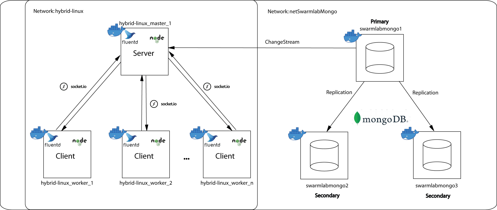

# Υπολογιστική Νέφους και Υπηρεσίες - Εργαστηριακή Άσκηση 2021: Υπηρεσία Συλλογής Δεδομένων (Data Collector Service)
Ψαραύτης-Σουράνης Συμεών - [@Simosps](https://git.swarmlab.io:3000/Simosps) - Αριθμός Μητρώου: 141049
___

## Γενικές Πληροφορίες για το Εικονικό Εργαστήριο
### 1. Περιγραφή

Το συγκεκριμένο εικονικό εργαστήριο στοχεύει στο να παρέχει στον ή στους χρήστες που θα το χρησιμοποιούν, τη δυνατότητα αυτοματοποιημένης συλλογής και αποθήκευσης σε ένα κεντρικό σημείο όπου στην περίπτωσή μας θα είναι μία βάση δεδομένων, συμβάντων που συμβαίνουν στους τερματικούς σταθμούς του σμήνους, καθώς και τη δυνατότητα γνωστοποίησης των συμβάντων αυτών στους τερματικούς σταθμούς, με μηνύματα που στέλνονται μέσω websocket. 

Για την επίτευξη του παραπάνω στόχου, το εικονικό εργαστήριο:
- διαθέτει δικό του δίκτυο
- παρέχει πρόγραμμα για τη συλλογή των δεδομένων
- περιλαμβάνει βάση δεδομένων (Database replication)
- επιτρέπει onEvent αποθήκευση των δεδομένων στη βάση
- διαθέτει Websocket σύνδεσης με τη βάση για άμεση μεταφορά των δεδομένων  

### 2. Τεχνολογίες που χρησιμοποιήθηκαν

- [Ansible](https://www.ansible.com/) 
Λογισμικό για την εγκατάσταση υπηρεσιών και την εκτέλεση εντολών στους κόμβους του σμήνους, απομακρυσμένα.
- [Fluentd](https://www.fluentd.org/) 
Λογισμικό για τη συλλογή των δεδομένων.
- [MongoDB](https://www.mongodb.com/) 
Πρόγραμμα βάσης δεδομένων για την αποθήκευση των δεδομένων.
- [Node.js](https://nodejs.org/en/) 
Πλατφόρμα ανάπτυξης λογισμικού σε γλώσσα προγραμματισμού JavaScript για τη συγγραφή του κώδικα για την επικοινωνία ανάμεσα στον εξυπηρετητή (server) και τους πελάτες (clients).
- [Socket.IO](https://socket.io/) 
Βιβλιοθήκη JavaScript για την επίτευξη αμφίδρομης επικοινωνίας μεταξύ του εξυπηρετητή (server) και των πελατών (clients) σε πραγματικό χρόνο.  

### 3. Διάγραμμα αρχιτεκτονικής εικονικού εργαστηρίου

Η αρχιτεκτονική του εικονικού εργαστηρίου που σκοπεύουμε να υλοποιήσουμε, φαίνεται στο ακόλουθο διάγραμμα:

  

Πληροφορίες για την εγκατάσταση του εικονικού εργαστηρίου μπορείτε να βρείτε στο αρχείο [INSTALL](https://git.swarmlab.io:3000/Simosps/data_collector_service/src/branch/master/docs/INSTALL.md)

Πληροφορίες για τη χρήση του εικονικού εργαστηρίου μπορείτε να βρείτε στο αρχείο [USAGE](https://git.swarmlab.io:3000/Simosps/data_collector_service/src/branch/master/docs/USAGE.md)
