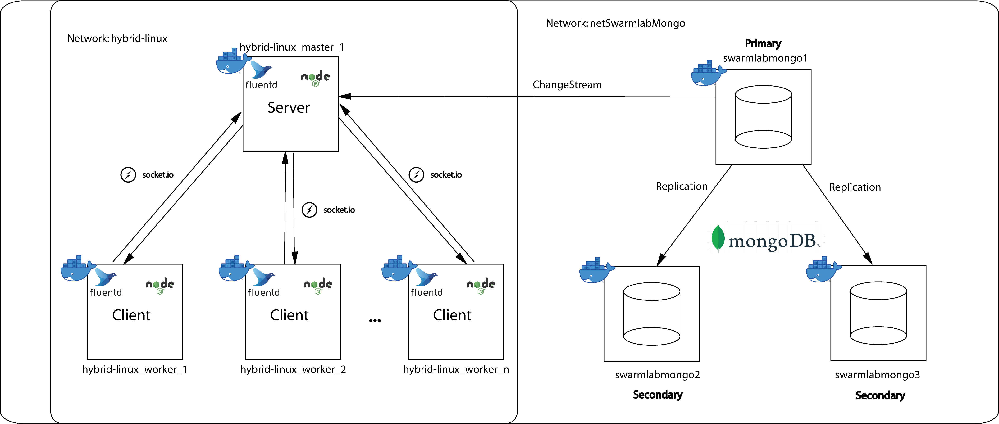

# Υπολογιστική Νέφους και Υπηρεσίες - Εργαστηριακή Άσκηση 2021: Υπηρεσία Συλλογής Δεδομένων (Data Collector Service)
Ψαραύτης-Σουράνης Συμεών - [@Simosps](https://git.swarmlab.io:3000/Simosps) - Αριθμός Μητρώου: 141049
___

## 1. Γενικές Πληροφορίες για το Εικονικό Εργαστήριο
### 1.1 Περιγραφή
Στο παρόν αρχείο, θα περιγράψουμε τον τρόπο με τον οποίο μπορούμε να δημιουργήσουμε ένα εικονικό εργαστήριο (vlab), κάνοντας χρήση του εργαλείου [docker](https://www.docker.com/), το οποίο είναι μία πλατφόρμα ανοικτού κώδικα, που προσφέρει αυτοματοποιημένες διαδικασίες, για την εύκολη υλοποίηση, διάθεση και εκτέλεση εφαρμογών.
Αρχικά, θα δείξουμε πως μπορούμε μέσω του συγκεκριμένου εργαλείου, να δημιουργήσουμε ένα σμήνος (swarm), δηλαδή μία ομάδα από τερματικούς σταθμούς (hosts) που περιλαμβάνουν containers, τα οποία είναι πακέτα λογισμικού που περιέχουν όλα τα απαραίτητα προγράμματα και ρυθμίσεις, ούτως ώστε μία εφαρμογή να μπορεί να εκτελείται γρήγορα και αξιόπιστα σε διαφορετικά υπολογιστικά περιβάλλοντα.
Στη συνέχεια, θα εγκαταστήσουμε τα απαραίτητα προγράμματα και ρυθμίσεις που θα πρέπει να περιέχει το καθε container, ούτως ώστε να καλύπτεται ο στόχος του εικονικού εργαστηρίου.
Στόχος του εικονικού εργαστηρίου, είναι να παρέχεται στον ή στους χρήστες που θα το χρησιμοποιούν, η δυνατότητα συλλογής και αποθήκευσης σε ένα κεντρικό σημείο, συμβάντων που συμβαίνουν στους τερματικούς σταθμούς του σμήνους, καθώς και η γνωστοποίηση των συμβάντων στους τερματικούς σταθμούς, μέσω broadcast μηνυμάτων. 

Για την επίτευξη του παραπάνω στόχου, το εικονικό εργαστήριο:
- θα διαθέτει δικό του δίκτυο
- θα παρέχει πρόγραμμα για τη συλλογή των δεδομένων
- θα επιτρέπει onEvent - τοπική/προσωρινή αποθήκευση των δεδομένων
- θα περιλαμβάνει βάση δεδομένων (Database replication)
- θα επιτρέπει onEvent αποθήκευση των δεδομένων στη βάση
- θα διαθέτει Websocket σύνδεσης με τη βάση για άμεση μεταφορά των δεδομένων

### 1.2 Τεχνολογίες που θα χρησιμοποιηθούν

- [Ansible](https://www.ansible.com/) 
Λογισμικό για την εγκατάσταση υπηρεσιών και την εκτέλεση εντολών στους κόμβους του σμήνους, απομακρυσμένα.
- [Fluentd](https://www.fluentd.org/) 
Λογισμικό για τη συλλογή των δεδομένων.
- [MongoDB](https://www.mongodb.com/) 
Πρόγραμμα βάσης δεδομένων για την αποθήκευση των δεδομένων.
- [Node.js](https://nodejs.org/en/) 
Πλατφόρμα ανάπτυξης λογισμικού σε γλώσσα προγραμματισμού JavaScript για τη συγγραφή του κώδικα για την επικοινωνία μεταξύ του εξυπηρετητή (master) και των πελατών (workers).
- [Socket.IO](https://socket.io/) 
Βιβλιοθήκη JavaScript για την επίτευξη αμφίδρομης επικοινωνίας μεταξύ του εξυπηρετητή (master) και των πελατών (workers) σε πραγματικό χρόνο.

### 1.3 Διάγραμμα αρχιτεκτονικής εικονικού εργαστηρίου

Η αρχιτεκτονική του εικονικού εργαστηρίου που σκοπεύουμε να υλοποιήσουμε, φαίνεται στην ακόλουθη εικόνα:

