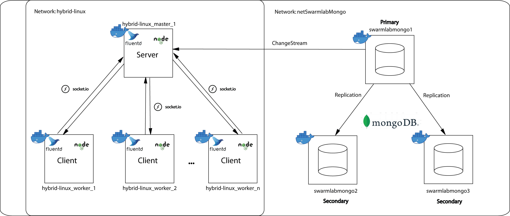

# Cloud Computing and Services – Lab Exercise 2021: Data Collector Service
[@simospsaraftis](https://github.com/simospsaraftis)

## General Information About the Application

### 1. Description

This project titled [data_collector_service](https://github.com/simospsaraftis/data_collector_service.git), implements a service that enables the automated collection and storage of event data from nodes in a cluster, as well as the real-time distribution of these events to the rest of the nodes via messaging. 

To achieve this, the application includes:

A dedicated virtual network

A data/event collection agent

A replicated MongoDB database for persistence

Event-based ("onEvent") data storage

A change stream mechanism to detect and transmit changes from the database to the cluster's master node

A communication mechanism from the master node to worker nodes to forward events in real time  

The cluster is deployed using the [hybrid-linux](https://git.swarmlab.io:3000/swarmlab/hybrid-linux) platform, provided by the [swarmlab.io](http://docs.swarmlab.io/) environment, and is managed using [docker](https://www.docker.com/).

For storage support, the system utilizes the [storage-mongo-replica](https://git.swarmlab.io:3000/swarmlab/storage-mongo-replica), also provided by the [swarmlab.io](http://docs.swarmlab.io/) environment.

### 2. Technologies Used

- [Ansible](https://www.ansible.com/) 
Used to remotely install services and execute commands on cluster nodes.
- [Fluentd](https://www.fluentd.org/) 
Collects and pushes data/events into the database.
- [MongoDB](https://www.mongodb.com/) 
Stores the collected data and supports replication.
- [Node.js](https://nodejs.org/en/) 
Provides the backend environment for communication between server and clients.
- [Socket.IO](https://socket.io/) 
Enables real-time, bidirectional communication between server and clients.  

### 3. Application Architecture Diagram

The architecture of the application is illustrated in the following diagram:

  

# Υπολογιστική Νέφους και Υπηρεσίες - Εργαστηριακή Άσκηση 2021: Υπηρεσία Συλλογής Δεδομένων (Data Collector Service)
[@simospsaraftis](https://github.com/simospsaraftis)

## Γενικές Πληροφορίες για την Εφαρμογή

### 1. Περιγραφή

Το παρόν project με όνομα [data_collector_service](https://github.com/simospsaraftis/data_collector_service.git) παρέχει μια εφαρμογή η οποία επιτρέπει την αυτοματοποιημένη συλλογή και αποθήκευση σε μία βάση δεδομένων, συμβάντων που συμβαίνουν στους κόμβους ενός σμήνους, καθώς και τη γνωστοποίηση των συμβάντων αυτών στους κόμβους του σμήνους, μέσω μηνυμάτων. 

Για την επίτευξη των παραπάνω, η εφαρμογή:
- διαθέτει δικό της δίκτυο
- παρέχει πρόγραμμα για τη συλλογή των δεδομένων/συμβάντων
- περιλαμβάνει βάση δεδομένων (Database replication)
- επιτρέπει onEvent αποθήκευση των δεδομένων/συμβάντων στη βάση
- διαθέτει change stream για την άμεση ανίχνευση και μεταφορά των δεδομένων/συμβάντων από τη βάση στον κεντρικό κόμβο (master) του σμήνους
- διαθέτει μηχανισμό σύνδεσης του κεντρικού κόμβου (master) με τους υπόλοιπους κόμβους (workers) του σμήνους, για μεταφορά των δεδομένων/συμβάντων σε αυτούς σε πραγματικό χρόνο  

Για τη δημιουργία του σμήνους, αξιοποιείται η υπηρεσία [hybrid-linux](https://git.swarmlab.io:3000/swarmlab/hybrid-linux), που παρέχεται από το περιβάλλον [swarmlab.io](http://docs.swarmlab.io/), η εγκατάσταση και η διάθεση της οποίας πραγματοποιείται μέσω του εργαλείου [docker](https://www.docker.com/).

Για την υποστήριξη 'χώρου αποθήκευσης', αξιοποιείται η υπηρεσία [storage-mongo-replica](https://git.swarmlab.io:3000/swarmlab/storage-mongo-replica), που επίσης παρέχεται από το περιβάλλον [swarmlab.io](http://docs.swarmlab.io/).

### 2. Τεχνολογίες που χρησιμοποιούνται

- [Ansible](https://www.ansible.com/) 
Λογισμικό για την εγκατάσταση υπηρεσιών και την εκτέλεση εντολών στους κόμβους του σμήνους, απομακρυσμένα.
- [Fluentd](https://www.fluentd.org/) 
Λογισμικό για τη συλλογή των δεδομένων/συμβάντων και την αποθήκευσή τους στη βάση δεδομένων.
- [MongoDB](https://www.mongodb.com/) 
Πρόγραμμα βάσης δεδομένων που παρέχει τον χώρο αποθήκευσης των δεδομένων.
- [Node.js](https://nodejs.org/en/) 
Πλατφόρμα ανάπτυξης λογισμικού σε γλώσσα προγραμματισμού JavaScript για τη συγγραφή του κώδικα για την επικοινωνία ανάμεσα στον εξυπηρετητή (server) και τους πελάτες (clients).
- [Socket.IO](https://socket.io/) 
Βιβλιοθήκη JavaScript για την επίτευξη αμφίδρομης επικοινωνίας μεταξύ του εξυπηρετητή (server) και των πελατών (clients) σε πραγματικό χρόνο.  

### 3. Διάγραμμα αρχιτεκτονικής της εφαρμογής

Η αρχιτεκτονική της εφαρμογής, φαίνεται στο ακόλουθο διάγραμμα:

  

Πληροφορίες για την εγκατάσταση της εφαρμογής μπορείτε να βρείτε στο αρχείο [INSTALL](./INSTALL.md)

Πληροφορίες για τη χρήση της εφαρμογής μπορείτε να βρείτε στο αρχείο [USAGE](./USAGE.md)
