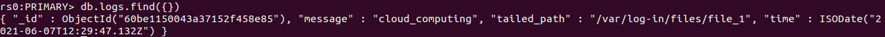
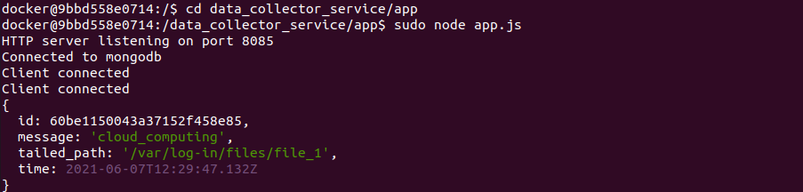
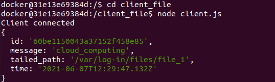
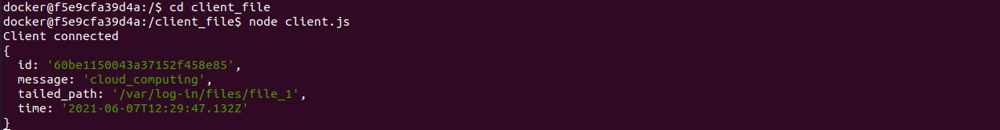

# Υπολογιστική Νέφους και Υπηρεσίες - Εργαστηριακή Άσκηση 2021: Υπηρεσία Συλλογής Δεδομένων (Data Collector Service)
[@simospsaraftis](https://github.com/simospsaraftis)
___


## Χρήση του εικονικού εργαστηρίου

Στο παρόν αρχείο, θα δούμε πως μπορούμε να κάνουμε χρήση του εικονικού εργαστηρίου που έχουμε δημιουργήσει.<br/>
Πιο συγκεκριμένα, θα δείξουμε μέσω ενός σεναρίου χρήσης, πως οι υπηρεσίες και τα εργαλεία που εγκαταστήσαμε, λειτουργούν και συνεργάζονται μεταξύ τους, για την εύρυθμη λειτουργία του εικονικού εργαστηρίου.


Αρχικά, εισερχόμαστε στον κόμβο hybrid-linux_master_1, δηλαδή στον κόμβο που αποτελεί τον master, εκτελώντας την ακόλουθη εντολή στο τερματικό:<br/><br/>

```
docker exec -it -udocker hybrid-linux_master_1 /bin/bash
```
<br/><br/>
Στη συνέχεια, μεταβαίνουμε στον κατάλογο /data_collector_service/app/ και ενεργοποιούμε τον server, εκτελώντας την ακόλουθη εντολή στο τερματικό του hybrid-linux_master_1:<br/><br/>

```
sudo node app.js
```
<br/><br/>
Εάν εμφανιστεί το μήνυμα "HTTP server listening on port 8085", αυτό σημαίνει ότι έχει ενεργοποιηθεί επιτυχώς ο server, και ακούει για τυχόν συνδέσεις στην πόρτα 8085.<br/>
Εάν εμφανιστεί το μήνυμα "Connected to mongodb", αυτό σημαίνει ότι έχει πραγματοποιηθεί επιτυχώς η σύνδεση του server με τη βάση δεδομένων. Ο server μέσω ενός ChangeStream παρακολουθεί για τυχόν αλλαγές στη βάση δεδομένων.<br/> 
Εάν δεν εμφανιστεί το παραπάνω μήνυμα, αυτό σημαίνει είτε ότι η βάση δεν έχει δημιουργηθεί, το οποίο μπορεί να λυθεί δημιουργώντας τη βάση, ακολουθώντας τα βήματα που αναφέρονται στο αρχείο εγκατάστασης του εικονικού εργαστηρίου, είτε ότι οι κόμβοι του σμήνους δεν έχουν συνδεθεί με το δίκτυο της βάσης, το οποίο μπορεί να λυθεί, συνδέοντας τους κόμβους του σμήνους με το δίκτυο της βάσης, ακολουθώντας τα βήματα που αναφέρονται στο αρχείο εγκατάστασης του εικονικού εργαστηρίου. Στο μεταξύ, ο server θα δοκιμάζει να ξανασυνδεθεί με τη βάση δεδομένων κάθε 5 δευτερόλεπτα.

Εάν όλα έχουν πάει καλά, συνδεόμαστε στους workers (hybrid-linux_worker_1 και hybrid-linux_worker_2), εκτελώντας τις ακόλουθες εντολές σε διαφορετικά τερματικά:<br/><br/>

```
docker exec -it -udocker hybrid-linux_worker_1 /bin/bash
```

```
docker exec -it -udocker hybrid-linux_worker_2 /bin/bash
```
<br/><br/>
Μεταβαίνουμε στον κατάλογο client_file και ενεργοποιούμε τους clients, εκτελώντας την ακόλουθη εντολή στα τερματικά των workers:
<br/><br/>
```
sudo node client.js
```
<br/><br/>
Εάν εμφανιστεί το μήνυμα "Client connected", αυτό σημαίνει ότι η δημιουργία του client και η σύνδεσή του με τον server ήταν επιτυχής.

Συνδεόμαστε στο replica swarmlabmongo1 της [MongoDB](https://www.mongodb.com/) βάσης δεδομένων, εκτελώντας την ακόλουθη εντολή σε διαφορετικό τερματικό:
<br/><br/>
```
docker exec -it swarmlabmongo1 /bin/sh
```
<br/>

Εισερχόμαστε στο command line της [MongoDB](https://www.mongodb.com/) εκτελώντας τις ακόλουθες εντολές στο τερματικό:
<br/><br/>
```
bash
mongo
```
<br/><br/>
Χρησιμοποιούμε τη βάση δεδομένων app_swarmlab και πραγματοποιούμε αυθεντικοποίηση εκτελώντας τις ακόλουθες εντολές στο τερματικό:
<br/><br/>
```
use app_swarmlab
db.auth('app_swarmlab','app_swarmlab')
```
<br/><br/>
Εάν μετά την αυθεντικοποίηση εμφανιστεί στο τερματικό ο αριθμός "1", αυτό σημαίνει ότι η αυθεντικοποίηση ήταν επιτυχής, σε διαφορετική περίπτωση, έχουμε κάνει κάποιο λάθος, οπότε ξαναπροσπαθούμε.

Εκτελώντας την ακόλουθη εντολή, μπορούμε να δούμε το περιεχόμενο του collection με όνομα "logs":
<br/><br/>
```
db.logs.find({})
```
<br/><br/>
Η εκτέλεση της παραπάνω εντολής δεν εμφανίζει τίποτα διότι δεν έχουν προστεθεί ακόμη δεδομένα στη βάση δεδομένων, ούτως ώστε να δημιουργηθεί το collection με όνομα "logs".

Στη συνέχεια, για να ελέγξουμε ότι οι υπηρεσίες που εγκαταστήσαμε λειτουργούν σωστά, επιλέγουμε κάποιον από τους κόμβους του σμήνους και δημιουργούμε έναν κατάλογο με όνομα files μέσα στον κατάλογο /var/log-in/ και στον κατάλογο files δημιουργούμε ένα αρχείο με όνομα file_1, μέσω των ακόλουθων εντολών:
<br/><br/>

```
mkdir /var/log-in/files
touch /var/log-in/files/file_1
```

<br/><br/>
Οποιαδήποτε αλλαγή πραγματοποιούμε σε αυτό το αρχείο, θα στέλνεται μέσω του [fluentd](https://www.fluentd.org/), ως συμβάν στη βάση δεδομένων, και στη συνέχεια μέσω του ChangeStream, θα εντοπίζεται, θα λαμβάνεται και θα εμφανίζεται στο τερματικό από τον master/server και θα αποστέλλεται στους workers εκείνους οι οποίοι είναι clients, δηλαδή έχουν εγκαθιδρύσει μία σύνδεση με τον server. Έπειτα, οι clients θα εμφανίζουν τα συμβάντα αυτά στο τερματικό τους.

Μέσω της ακόλουθης εντολής, προσθέτουμε τη φράση "cloud computing" στο αρχείο file_1:
<br/><br/>
```
echo "cloud_computing" >> /var/log-in/files/file_1
```
<br/><br/>

Μετά από λίγο, ελέγχουμε τη βάση δεδομένων, και συγκεκριμένα το περιεχόμενο του collection με όνομα "logs", και παρατηρούμε ότι υπάρχει η ακόλουθη εγγραφή:

<br/><br/>


<br/><br/>
Αυτό σημαίνει ότι το συμβάν εντοπίστηκε από το [fluentd](https://www.fluentd.org/) και στάλθηκε επιτυχώς στη βάση δεδομένων.

Ελέγχουμε τα τερματικά του server και των client και παρατηρούμε ότι υπάρχει η ακόλουθη εγγραφή:
<br/><br/>



<br/><br/>


<br/><br/>


<br/><br/>
Αυτό σημαίνει ότι ο server μέσω του ChangeStream εντόπισε την εγγραφή στη βάση δεδομένων, την εμφάνισε στο τερματικό του, και την έστειλε στους clients οι οποίοι την εμφάνισαν στα δικά τους τερματικά.

Με την εκτέλεση των παραπάνω σεναρίου χρήσης, και την εμφάνιση των παραπάνω αποτελεσμάτων, έχουμε ολοκληρώσει τη παρουσίαση του τρόπου χρήσης του εικονικού εργαστηρίου.
