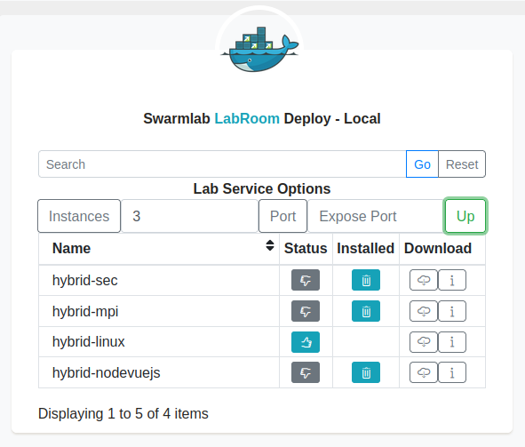

# Υπολογιστική Νέφους και Υπηρεσίες - Εργαστηριακή Άσκηση 2021: Υπηρεσία Συλλογής Δεδομένων (Data Collector Service)
Ψαραύτης-Σουράνης Συμεών - [@Simosps](https://git.swarmlab.io:3000/Simosps) - Αριθμός Μητρώου: 141049
___
## 1. Γενικές Πληροφορίες για το Project
### 1.1 Περιγραφή
Στο παρόν αρχείο, θα περιγράψουμε τον τρόπο με τον οποίο μπορούμε να δημιουργήσουμε ένα εικονικό εργαστήριο (vlab), κάνοντας χρήση του εργαλείου [docker](https://www.docker.com/), το οποίο είναι ένα εργαλείο που προσφέρει αυτοματοποιημένες διαδικασίες, για την εύκολη υλοποίηση, διάθεση και εκτέλεση εφαρμογών.
Πιο συγκεκριμένα, αρχικά θα δείξουμε πως μπορούμε μέσω του συγκεκριμένου εργαλείου, να δημιουργήσουμε ένα σμήνος (swarm), δηλαδή μία ομάδα από τερματικούς σταθμούς (hosts) που περιλαμβάνουν containers, δηλαδή πακέτα λογισμικού που περιέχουν όλες τις απαραίτητες υπηρεσίες, ούτως ώστε μία εφαρμογή να μπορεί να εκτελείται γρήγορα και αξιόπιστα σε διαφορετικά υπολογιστικά περιβάλλοντα.
Στη συνέχεια, θα ορίσουμε τις υπηρεσίες που θα πρέπει να περιέχει το καθε container, ούτως ώστε να καλύπτεται ο στόχος του εικονικού εργαστηρίου, δηλαδή να παρέχεται στον ή στους χρήστες που θα το χρησιμοποιούν, η δυνατότητα συλλογής και αποθήκευσης σε ένα κεντρικό σημείο, συμβάντων που συμβαίνουν στους τερματικούς σταθμούς του σμήνους.  
Για την επίτευξη του παραπάνω στόχου, το εικονικό εργαστήριο:
- θα διαθέτει δικό του δίκτυο
- θα παρέχει πρόγραμμα για τη συλλογή των δεδομένων
- θα επιτρέπει onEvent - τοπική/προσωρινή αποθήκευση των δεδομένων
- θα περιλαμβάνει βάση δεδομένων (Database replication)
- θα επιτρέπει onEvent αποθήκευση των δεδομένων στη βάση
- θα διαθέτει Websocket σύνδεσης με τη βάση για άμεση μεταφορά των δεδομένων

### 1.2 Τεχνολογίες που θα χρησιμοποιηθούν

- [Ansible](https://www.ansible.com/) 
Λογισμικό για την εγκατάσταση των υπηρεσιών στους κόμβους του σμήνους.
- [Fluentd](https://www.fluentd.org/) 
Λογισμικό για τη συλλογή των δεδομένων.
- [MongoDB](https://www.mongodb.com/) 
Πρόγραμμα βάσης δεδομένων για την αποθήκευση των δεδομένων.
- [Node.js](https://nodejs.org/en/) 
Πλατφόρμα ανάπτυξης λογισμικού σε γλώσσα προγραμματισμού JavaScript για τη συγγραφή του κώδικα για την επικοινωνία μεταξύ του εξυπηρετητή (master) και των πελατών (workers).
- [Socket.IO](https://socket.io/) 
Βιβλιοθήκη JavaScript για την επίτευξη αμφίδρομης επικοινωνίας μεταξύ του εξυπηρετητή (master) και των πελατών (workers) σε πραγματικό χρόνο.

### 1.3 Διάγραμμα αρχιτεκτονικής εικονικού εργαστηρίου

Η αρχιτεκτονική του εικονικού εργαστηρίου που πρόκειται να υλοποιήσουμε, φαίνεται στην ακόλουθη εικόνα:

## 2. Εγκατάσταση Εικονικού Εργαστηρίου

Για την εγκατάσταση του εικονικού εργαστηρίου, θα αξιοποιηθεί το ήδη υπάρχον εικονικό εργαστήριο [hybrid-linux](https://git.swarmlab.io:3000/swarmlab/hybrid-linux), που παρέχεται από το [swarmlab.io](http://docs.swarmlab.io/), και το οποίο θα αποτελέσει τη βάση για τη δημιουργία του εικονικού εργαστηρίου που περιγράψαμε στη παράγραφο 1.1. Επιπλέον, για την υποστήριξη 'χώρου αποθήκευσης', θα χρησιμοποιηθεί η υπηρεσία [storage-mongo-replica](https://git.swarmlab.io:3000/swarmlab/storage-mongo-replica), που επίσης παρέχεται από το [swarmlab.io](http://docs.swarmlab.io/).

### 2.1 Δημιουργία του σμήνους (swarm)

Σε αυτή τη παράγραφο, θα προσπαθήσουμε δημιουργήσουμε ένα σμήνος, το οποίο θα αποτελείται από έναν κεντρικό κόμβο, τον master, και έναν ή περισσότερους κόμβους με τους οποίους θα συνδέεται ο master (workers).
Για να το επιτύχουμε αυτό, θα αξιοποιήσουμε όπως είπαμε και παραπάνω, το ήδη υπάρχον εικονικό εργαστήριο [hybrid-linux](https://git.swarmlab.io:3000/swarmlab/hybrid-linux) του [swarmlab.io](http://docs.swarmlab.io/).
Συνδεόμαστε λοιπόν με τον λογαριασμό μας στο [swarmlab.io](http://docs.swarmlab.io/), μεταβαίνουμε στην καρτέλα Private/Local -> LabRoom και επιλέγουμε να σηκώσουμε τρια instances, δηλαδή τρεις κόμβους, εκ των οποίων ο ένας θα αποτελεί τον master και οι άλλοι δύο, τους workers του σμήνους.

Να αναφέρουμε εδώ, ότι για να μπορέσει το εικονικό εργαστήριο να εκτελέσει όλες τις υπηρεσίες που θα παρέχει στους χρήστες, θα πρέπει να ορίσουμε το σμήνος να διαθέτει τουλάχιστον δύο instances, δηλαδή τουλάχιστον έναν master και έναν worker.