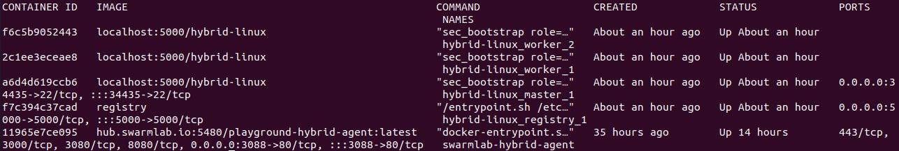
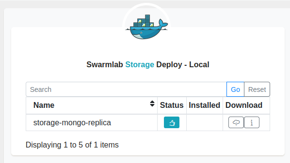
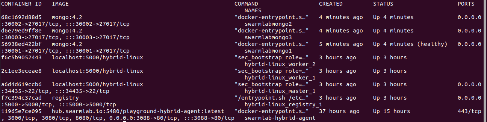
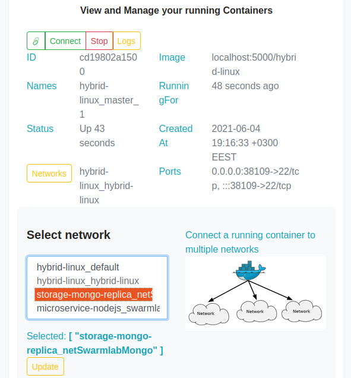

# Υπολογιστική Νέφους και Υπηρεσίες - Εργαστηριακή Άσκηση 2021: Υπηρεσία Συλλογής Δεδομένων (Data Collector Service)
Ψαραύτης-Σουράνης Συμεών - [@Simosps](https://git.swarmlab.io:3000/Simosps) - Αριθμός Μητρώου: 141049
___
## 1. Γενικές Πληροφορίες για το Εικονικό Εργαστήριο
### 1.1 Περιγραφή
Στο παρόν αρχείο, θα περιγράψουμε τον τρόπο με τον οποίο μπορούμε να δημιουργήσουμε ένα εικονικό εργαστήριο (vlab), κάνοντας χρήση του εργαλείου [docker](https://www.docker.com/), το οποίο είναι μία πλατφόρμα ανοικτού κώδικα, που προσφέρει αυτοματοποιημένες διαδικασίες, για την εύκολη υλοποίηση, διάθεση και εκτέλεση εφαρμογών.
Αρχικά, θα δείξουμε πως μπορούμε μέσω του συγκεκριμένου εργαλείου, να δημιουργήσουμε ένα σμήνος (swarm), δηλαδή μία ομάδα από τερματικούς σταθμούς (hosts) που περιλαμβάνουν containers, τα οποία είναι πακέτα λογισμικού που περιέχουν όλα τα απαραίτητα προγράμματα και ρυθμίσεις, ούτως ώστε μία εφαρμογή να μπορεί να εκτελείται γρήγορα και αξιόπιστα σε διαφορετικά υπολογιστικά περιβάλλοντα.
Στη συνέχεια, θα εγκαταστήσουμε τα απαραίτητα προγράμματα και ρυθμίσεις που θα πρέπει να περιέχει το καθε container, ούτως ώστε να καλύπτεται ο στόχος του εικονικού εργαστηρίου.
Στόχος του εικονικού εργαστηρίου, είναι να παρέχεται στον ή στους χρήστες που θα το χρησιμοποιούν, η δυνατότητα συλλογής και αποθήκευσης σε ένα κεντρικό σημείο, συμβάντων που συμβαίνουν στους τερματικούς σταθμούς του σμήνους, καθώς και η γνωστοποίηση των συμβάντων στους τερματικούς σταθμούς, μέσω broadcast μηνυμάτων. 

Για την επίτευξη του παραπάνω στόχου, το εικονικό εργαστήριο:
- θα διαθέτει δικό του δίκτυο
- θα παρέχει πρόγραμμα για τη συλλογή των δεδομένων
- θα επιτρέπει onEvent - τοπική/προσωρινή αποθήκευση των δεδομένων
- θα περιλαμβάνει βάση δεδομένων (Database replication)
- θα επιτρέπει onEvent αποθήκευση των δεδομένων στη βάση
- θα διαθέτει Websocket σύνδεσης με τη βάση για άμεση μεταφορά των δεδομένων

### 1.2 Τεχνολογίες που θα χρησιμοποιηθούν

- [Ansible](https://www.ansible.com/)<br/>
Λογισμικό για την εγκατάσταση υπηρεσιών και την εκτέλεση εντολών στους κόμβους του σμήνους, απομακρυσμένα.
- [Fluentd](https://www.fluentd.org/)<br/>
Λογισμικό για τη συλλογή των δεδομένων.
- [MongoDB](https://www.mongodb.com/)<br/>
Πρόγραμμα βάσης δεδομένων για την αποθήκευση των δεδομένων.
- [Node.js](https://nodejs.org/en/)<br/>
Πλατφόρμα ανάπτυξης λογισμικού σε γλώσσα προγραμματισμού JavaScript για τη συγγραφή του κώδικα για την επικοινωνία μεταξύ του εξυπηρετητή (master) και των πελατών (workers).
- [Socket.IO](https://socket.io/)<br/>
Βιβλιοθήκη JavaScript για την επίτευξη αμφίδρομης επικοινωνίας μεταξύ του εξυπηρετητή (master) και των πελατών (workers) σε πραγματικό χρόνο.

### 1.3 Διάγραμμα αρχιτεκτονικής εικονικού εργαστηρίου

Η αρχιτεκτονική του εικονικού εργαστηρίου που πρόκειται να υλοποιήσουμε, φαίνεται στην ακόλουθη εικόνα:

## 2. Εγκατάσταση Εικονικού Εργαστηρίου

Για την εγκατάσταση του εικονικού εργαστηρίου, θα αξιοποιηθεί το ήδη υπάρχον εικονικό εργαστήριο [hybrid-linux](https://git.swarmlab.io:3000/swarmlab/hybrid-linux), που παρέχεται από το περιβάλλον [swarmlab.io](http://docs.swarmlab.io/), και το οποίο θα αποτελέσει τη βάση, για τη δημιουργία του εικονικού εργαστηρίου που περιγράψαμε στη παράγραφο 1.1. 

Επιπλέον, για την υποστήριξη 'χώρου αποθήκευσης', θα χρησιμοποιηθεί η υπηρεσία [storage-mongo-replica](https://git.swarmlab.io:3000/swarmlab/storage-mongo-replica), που επίσης παρέχεται από το περιβάλλον [swarmlab.io](http://docs.swarmlab.io/).

Για την εγκατάσταση των υπηρεσιών στα containers, θα χρησιμοποιηθεί το repository [data_collector_service](https://git.swarmlab.io:3000/Simosps/data_collector_service.git).

### 2.1 Προαπαιτούμενα

Για να αποκτήσουμε πρόσβαση στο περιβάλλον [swarmlab.io](http://docs.swarmlab.io/) και να εγκαταστήσουμε το εικονικό εργαστήριο [hybrid-linux](https://git.swarmlab.io:3000/swarmlab/hybrid-linux), θα πρέπει αρχικά να εγκαταστήσουμε την υπηρεσία swarmlab-hybrid και στη συνέχεια να δημιουργήσουμε λογαριασμό.

Περισσότερες πληροφορίες για την εγκατάσταση της υπηρεσίας swarmlab-hybrid, μπορείτε να βρείτε [εδώ](https://git.swarmlab.io:3000/zeus/swarmlab-hybrid).

### 2.2 Δημιουργία του σμήνους (swarm)

Σε αυτή τη παράγραφο, θα δημιουργήσουμε το σμήνος, το οποίο θα αποτελείται από έναν κεντρικό κόμβο, τον master, και έναν ή περισσότερους κόμβους με τους οποίους θα συνδέεται ο master (workers).
Για να το επιτύχουμε αυτό, θα αξιοποιήσουμε όπως είπαμε και παραπάνω, το ήδη υπάρχον εικονικό εργαστήριο [hybrid-linux](https://git.swarmlab.io:3000/swarmlab/hybrid-linux) του [swarmlab.io](http://docs.swarmlab.io/).

Συνδεόμαστε λοιπόν με τον λογαριασμό μας στο [swarmlab.io](http://docs.swarmlab.io/), και αφού φορτώσουμε τις ρυθμίσεις μας και συνδεθούμε στον server του [swarmlab.io](http://docs.swarmlab.io/), μεταβαίνουμε στην καρτέλα Private/Local -> LabRoom και επιλέγουμε να σηκώσουμε τρια instances, δηλαδή τρεις τερματικούς σταθμούς, εκ των οποίων ο ένας θα αποτελεί τον master και οι άλλοι δύο, τους workers του σμήνους.


Να αναφέρουμε εδώ, ότι για να μπορέσει το εικονικό εργαστήριο να εκτελέσει όλες τις υπηρεσίες που θα παρέχει στους χρήστες, θα πρέπει να ορίσουμε, το σμήνος να διαθέτει τουλάχιστον δύο instances, δηλαδή τουλάχιστον έναν master και έναν worker.

Εκτελώντας την ακόλουθη εντολή, μπορούμε να δούμε τα containers που έχουν δημιουργηθεί στο [docker](https://www.docker.com/):

```
docker container ls
```



Παρατηρώντας το αποτέλεσμα του τερματικού, μπορούμε να εντοπίσουμε τα τρία containers που δημιουργήσαμε, καθώς και διάφορα χαρακτηριστικά τους.

### 2.3 Κατανόηση της διαδικασίας δημιουργίας του σμήνους (swarm)

Για τον ορισμό των χαρακτηριστικών των κόμβων από τα οποία θα αποτελείται το σμήνος, το [swarmlab.io](http://docs.swarmlab.io/) χρησιμοποιεί το ακόλουθο docker-compose.yml αρχείο:

```
version: "2"

services:
  registry:
    image: registry
    ports:
      - "5000:5000"

  master:
    image: localhost:5000/hybrid-linux
    privileged: true
    environment:
     - NODENAME=hybrid-linux_master_1.hybrid-linux_hybrid-linux
     - NODENETWORK=hybrid-linux
    cap_add:
      - NET_ADMIN
    user: root
    entrypoint: ["sec_bootstrap", "role=master", "sec_master_service_name=master", "sec_worker_service_name=worker"]
    ports:
      - "${SSH_PORT}:22"
    networks:
      - hybrid-linux
    volumes:
      - /home/simos/swarmlab-hybrid/src-local/instance/hybrid-linux/hybrid-linux/project:/project


  worker:
    image: localhost:5000/hybrid-linux
    privileged: true
    environment:
     - NODENAME=hybrid-linux_master_1.hybrid-linux_hybrid-linux
     - NODENETWORK=hybrid-linux
    cap_add:
      - NET_ADMIN
    user: root
    entrypoint: ["sec_bootstrap", "role=worker", "sec_master_service_name=master", "sec_worker_service_name=worker"]
    networks:
      - hybrid-linux
    volumes:
      - /home/simos/swarmlab-hybrid/src-local/instance/hybrid-linux/hybrid-linux/project:/project

networks:
  hybrid-linux:
```

Για τη δημιουργία του σμήνους, το [swarmlab.io](http://docs.swarmlab.io/) χρησιμοποιεί το αρχείο swarmlab-sec και πιο συγκεκριμένα την ακόλουθη συνάρτηση για τη δημιουργία του master:

```
up_master ()
{
    printf "\\n\\n===> SPIN UP MASTER NODE"
    printf "\\n%s\\n" "$HEADER"
    echo "$ docker-compose up -d master"
    printf "\\n"
    docker-compose up -d master
}
```
και την ακόλουθη συνάρτηση για τον ορισμό του πλήθους και την δημιουργία των workers:
```
up_workers ()
{
    printf "\\n\\n===> SPIN UP WORKER NODES"
    printf "\\n%s\\n" "$HEADER"
    echo "$ docker-compose up -d worker"
    printf "\\n"
    docker-compose up -d worker 

    printf "\\n"
    printf "\\n%s\\n" "$HEADER"

    NUM_WORKER=$((SIZE - 1))
    echo "$ docker-compose scale worker=$NUM_WORKER"
    printf "\\n"
    docker-compose scale worker=${NUM_WORKER}
}
```


### 2.4 Ορισμός υπηρεσίας για την υποστήριξη 'χώρου αποθήκευσης'

Σε αυτή τη παράγραφο θα ορίσουμε την υπηρεσία για την υποστήριξη 'χώρου αποθήκευσης', η οποία θα είναι η [storage-mongo-replica](https://git.swarmlab.io:3000/swarmlab/storage-mongo-replica), που παρέχεται από το περιβάλλον [swarmlab.io](http://docs.swarmlab.io/).
Η συγκεκριμένη υπηρεσία παρέχει μία MongoDB βάση δεδομένων, που θα χρησιμοποιηθεί για την αποθήκευση των συμβάντων που συμβαίνουν στους τερματικούς σταθμούς του σμήνους.

Στο [swarmlab.io](http://docs.swarmlab.io/), μεταβαίνουμε στην καρτέλα Private/Local -> Storage, εκτελούμε την εντολή που θα μας εμφανίσει το σύστημα, και επιλέγουμε να σηκώσουμε τη βάση δεδομένων. Το [swarmlab.io](http://docs.swarmlab.io/), σηκώνει τρια replicas της υπηρεσίας, ωστόσο εμείς θα χρειαστούμε μόνο το ένα.

Εκτελούμε στο τερματικό την εντολή που μας εμφανίζει το παράθυρο, και επιλέγουμε να σηκώσουμε τη βάση δεδομένων:



Εκτελώντας την ακόλουθη εντολή, μπορούμε να δούμε τα containers που έχουν δημιουργηθεί στο [docker](https://www.docker.com/):

```
docker container ls
```



Παρατηρώντας το αποτέλεσμα του τερματικού, μπορούμε να δούμε εκτός των άλλων, και τις τρεις βάσεις δεδομένων που δημιουργήσαμε.

### 2.5 Κατανόηση της διαδικασίας δημιουργίας της βάσης δεδομένων

Για τον ορισμό των χαρακτηριστικών των containers που θα περιέχουν τη βάση δεδομένων, καθώς και για τη δημιουργία και διάθεση των containers, το [swarmlab.io](http://docs.swarmlab.io/) χρησιμοποιεί το ακόλουθο docker-compose.yml αρχείο:

```
version: '3.8'

services: 

    # setup MongoDB cluster for production
    mongo-replica-setup:
        container_name: mongo-setup
        image: 'mongo:4.2'
        restart: on-failure
        networks:
            - netSwarmlabMongo
        volumes:
        - ./.docker/mongodb/scripts/mongosetup.sh:/scripts/mongosetup.sh
        # entrypoint: ["bash"]
        entrypoint: ["bash", "/scripts/mongosetup.sh" ]
        env_file:
            - .env
        environment:
            MONGO_INITDB_ROOT_USERNAME: ${MONGO_INITDB_ROOT_USERNAME}
            MONGO_INITDB_ROOT_PASSWORD: ${MONGO_INITDB_ROOT_PASSWORD}
        depends_on:
            - swarmlabmongo1
            - swarmlabmongo2
            - swarmlabmongo3

    swarmlabmongo1:
        hostname: 'swarmlabmongo1'
        container_name: 'swarmlabmongo1'
        image: 'mongo:4.2'
        restart: 'on-failure'
        command: ["-f", "/etc/mongod.conf", "--keyFile", "/auth/file.key", "--replSet", "${MONGO_REPLICA_SET_NAME}", "--bind_ip_all"]
        expose: 
            - 27017
        ports: 
            - 30001:27017 
        networks: 
            - netSwarmlabMongo
        volumes:
            - swarmlabmongoData1:/data/db
            - swarmlabmongoLog1:/var/log/mongodb
            - ./.docker/mongodb/initdb.d/:/docker-entrypoint-initdb.d/
            - ./.docker/mongodb/mongod.conf:/etc/mongod.conf
            - ./.docker/mongodb/file.key:/auth/file.key
        healthcheck:
            test: test $$(echo "rs.status().ok" | mongo -u $${MONGO_INITDB_ROOT_USERNAME} -p $${MONGO_INITDB_ROOT_PASSWORD} --quiet) -eq 1
            interval: 30s
            start_period: 60s
        env_file:
            - .env
        environment:
            MONGO_INITDB_ROOT_USERNAME: ${MONGO_INITDB_ROOT_USERNAME}
            MONGO_INITDB_ROOT_PASSWORD: ${MONGO_INITDB_ROOT_PASSWORD}
            MONGO_INITDB_DATABASE: ${MONGO_INITDB_DATABASE}

    swarmlabmongo2:
        hostname: 'swarmlabmongo2'
        container_name: 'swarmlabmongo2'
        image: 'mongo:4.2'
        command: ["-f", "/etc/mongod.conf", "--keyFile", "/auth/file.key", "--replSet", "${MONGO_REPLICA_SET_NAME}", "--bind_ip_all"]
        restart: 'on-failure'
        expose: 
            - 27017
        ports: 
            - 30002:27017  
        networks: 
            - netSwarmlabMongo
        volumes:
            - swarmlabmongoData2:/data/db
            - swarmlabmongoLog2:/var/log/mongodb
            - ./.docker/mongodb/mongod.conf:/etc/mongod.conf
            - ./.docker/mongodb/file.key:/auth/file.key
        env_file:
            - .env
        environment:
            MONGO_INITDB_ROOT_USERNAME: ${MONGO_INITDB_ROOT_USERNAME}
            MONGO_INITDB_ROOT_PASSWORD: ${MONGO_INITDB_ROOT_PASSWORD}
            MONGO_INITDB_DATABASE: ${MONGO_INITDB_DATABASE}
        depends_on: 
            - swarmlabmongo1

    swarmlabmongo3:
        hostname: 'swarmlabmongo3'
        container_name: 'swarmlabmongo3'
        image: 'mongo:4.2'
        command: ["-f", "/etc/mongod.conf", "--keyFile", "/auth/file.key", "--replSet", "${MONGO_REPLICA_SET_NAME}", "--bind_ip_all"]
        restart: 'on-failure'
        expose: 
            - 27017
        ports: 
            - 30003:27017  
        networks: 
            - netSwarmlabMongo
        volumes:
            - swarmlabmongoData3:/data/db
            - swarmlabmongoLog3:/var/log/mongodb
            - ./.docker/mongodb/mongod.conf:/etc/mongod.conf
            - ./.docker/mongodb/file.key:/auth/file.key
        env_file:
            - .env
        environment:
            MONGO_INITDB_ROOT_USERNAME: ${MONGO_INITDB_ROOT_USERNAME}
            MONGO_INITDB_ROOT_PASSWORD: ${MONGO_INITDB_ROOT_PASSWORD}
            MONGO_INITDB_DATABASE: ${MONGO_INITDB_DATABASE}
        depends_on: 
            - swarmlabmongo1

volumes: 
    swarmlabmongoData1:
    swarmlabmongoData2:
    swarmlabmongoData3:
    swarmlabmongoLog1:
    swarmlabmongoLog2:
    swarmlabmongoLog3:
```

### 2.6 Σύνδεση των κόμβων του σμήνους με το δίκτυο στο οποίο βρίσκεται η βάση δεδομένων

Για λόγους καλύτερης διαχείρισης, έχουμε ορίσει η υπηρεσία της βάσης δεδομένων, να βρίσκεται σε διαφορετικό δίκτυο από τους κόμβους του σμήνους.<br/>
Επομένως, για να μπορούν να μεταφέρονται και να αποθηκεύονται στη βάση δεδομένων τα συμβάντα που συμβαίνουν στους κόμβους του σμήνους, και συλλέγονται μέσω του fluentd, θα πρέπει οι κόμβοι του σμήνους να είναι συνδεδεμένοι και με το δίκτυο της βάσης δεδομένων.<br/>

Για να πραγματοποιήσουμε αυτή τη σύνδεση, θα χρησιμοποιήσουμε το interface του [swarmlab.io](http://docs.swarmlab.io/).<br/>
Αρχικά, μεταβαίνουμε στην καρτέλα Instances -> Container και επιλέγουμε το container hybrid_linux_master_1, το οποίο αντιστοιχεί στον master του σμήνους. Στη συνέχεια, επιλέγουμε το δίκτυο storage-mongo-replica_netSwarmlabMongo, το οποίο αποτελεί το δίκτυο στο οποίο βρίσκεται η βάση δεδομένων, και πατάμε το κουμπί "Update", όπως φαίνεται στην παρακάτω εικόνα:




Πραγματοποιούμε την ίδια διαδικασία και για τους δύο workers (hybrid-linux_worker_1 και hybrid-linux_worker_2), ούτβς ώστε να συνδέονται και αυτοί με το δίκτυο της βάσης δεδομένων.


### 2.7 Εγκατάσταση της υπηρεσίας για τη συλλογή δεδομένων στα containers του σμήνους

Εισερχόμαστε στον κόμβο hybrid-linux_master_1, εκτελώντας την ακόλουθη εντολή στο τερματικό:

```
docker exec -it -udocker hybrid-linux_master_1 /bin/bash
```

Έπειτα, κατεβάζουμε το repository [data_collector_service](https://git.swarmlab.io:3000/Simosps/data_collector_service.git) και εισερχόμαστε σε αυτό, μέσω των ακόλουθων εντολών:

```
sudo git clone https://git.swarmlab.io:3000/Simosps/data_collector_service.git
cd data_collector_service
```